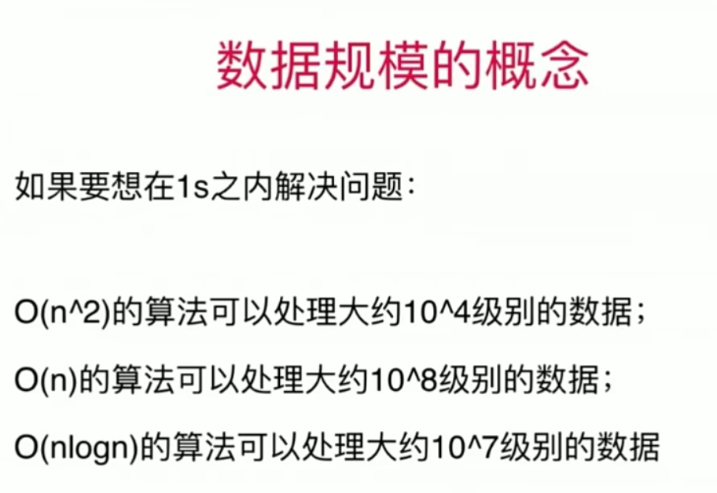
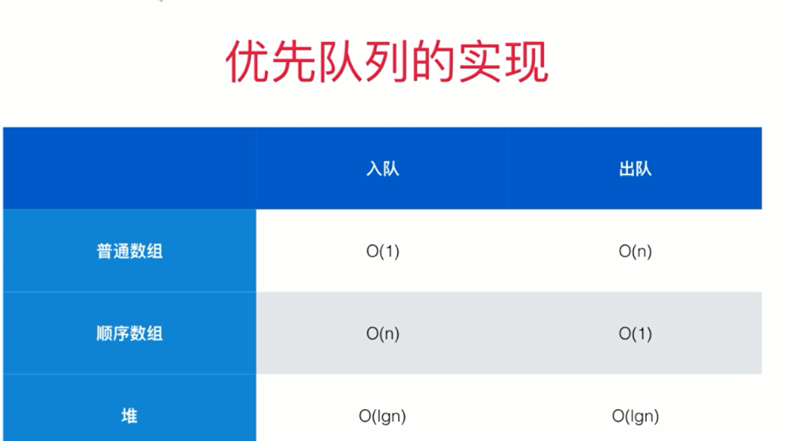
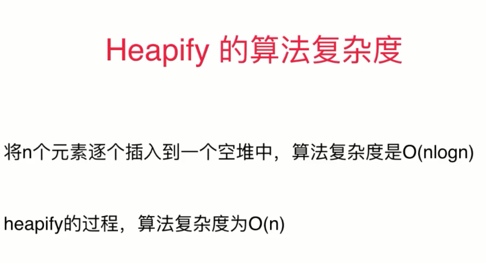

# :ram: 算法基础​

## 1、数据规模



## ==2、求中点下标整型溢出问题==

```java
//可能会产生整型溢出 l+r
int mid = (l+r)/2;
//不会产生整型溢出,使用减法代替加法
int mid = l + (r-l)/2;
```

## 3、清楚下标定义

==前闭后闭`[i, j]`     --    前闭后开`[i , j)`等==

==如果定义不同，算法对应的逻辑也不同！==

## 4、优先队列



## 5、构建堆

