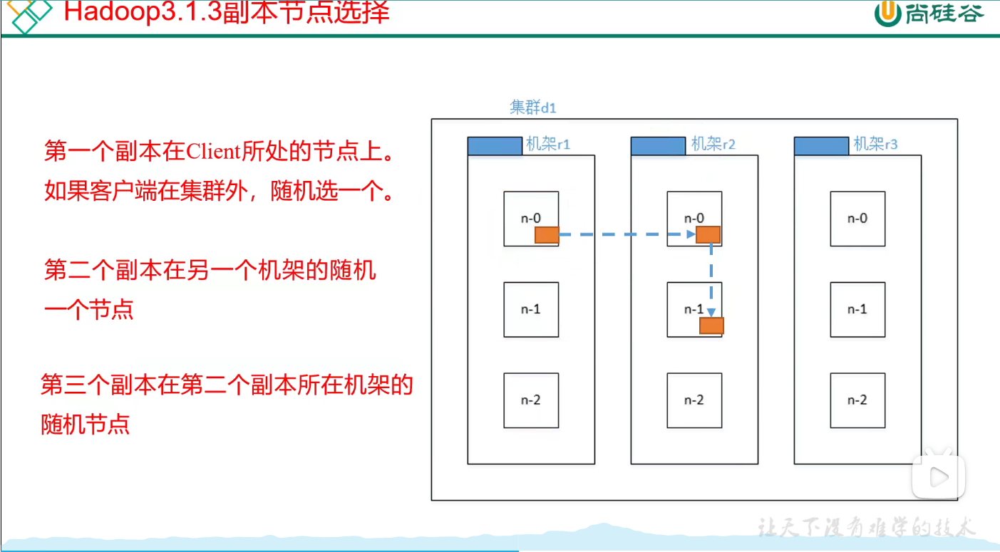

# HDFS

## 1、HDFS文件大小

在HDFS中的文件都是分块进行存储的（blocks），块的大小可以通过参数（dfs.blocksize）进行指定。默认情况下，在==hadoop2.x和3.x中都是128M==（可以在默认配置文件中查看），在1.x中是64M。

10KB的小文件存储在HDFS中时，所占用的实际物理空间就是只有10KB。这里默认的128M指的是一个文件块最大只能是128M，例如一个150M的文件将会被分为两个块，分别是128M和22M的两个文件块。文件的分块信息、块存储在哪台机器上等信息都会被存储在NameNode中，而文件块真正被存储在DataNode中。

==注意：HDFS中的文件只可以追加，不可以修改！！！==

### 问题：什么情况下是128M，什么情况下是256M？

假设在NameNode中寻找到目标块的信息需要10ms左右（寻址时间），研究表明：寻址时间是传输时间的百分之一时是最佳状态。

因此：传输时间 = 10ms / 0.01 = 1s

普通磁盘的传输速度一般为 100MB/s，固态硬盘的传输速度一般为 200MB/s ~ 300MB/s

所以一般企业中块大小都是128M，大厂中使用固态的就是256M


## 2、HDFS常用命令

（1）查看某个命令的具体用法（==最重要==）：-help

```shell
#查看ls命令的详细用法、参数
hadoop fs -help ls
#查看mkdir命令的详细用法、参数
hadoop fs -help mkdir
```

（2）查看某个目录中的文件列表：-ls

```shell
# 查看根目录下的文件列表
hadoop fs -ls /
```

（3）创建目录：mkdir

```shell
hadoop fs -mkdir /sanguo
```

（4）将本地文件移动到HFDS中（本地文件会消失）：-moveFromLocal

```shell
#将本地路径中的 ~/jpsall.sh这个文件 移动到 HDFS中的 /sanguo 目录中
hadoop fs -moveFromLocal ~/jpsall.sh /sanguo
```

（5）将本地文件拷贝到HDFS中：-copyFromLocal 或者 -put（==更推荐使用put==）

```shell
#将本地路径中的 ~/jpsall.sh这个文件 拷贝到 HDFS中的 /sanguo 目录中
hadoop fs -copyFromLocal ~/jpsall.sh /sanguo
hadoop fs -put ~/jpsall.sh /sanguo
```

（6）在文件末尾追加文件（要以文件的形式追加，不可以是以字符串的形式）：-appendToFile

```shell
#将test.txt中的内容追加到HDFS中的jpsall.sh 这个文件末尾
hadoop fs -appendToFile ~/test.txt /sanguo/jpsall.sh
```

（7）拷贝HDFS上的文件到本地：-copyToLocal 或者 -get(==更推荐使用get==)

```shell
#拷贝HDFS上/sanguo/jpsall.sh 这个文件到本地目录 ~/ 里面
hadoop fs -copyToLocal /sanguo/jpsall.sh ~/

#也可以在下载时修改文件名称(在这里下载到本地的文件jpsall2.sh)
hadoop fs -get /sanguo/jpsall.sh ~/jpsall2.sh
```

（8）操作文件的一系列命令和在linux中基本一样

```shell
# -cat 查看HDFS中文件的内容
hadoop fs -cat /sanguo/jpsall.sh

# -cp 将HDFS中的一个文件拷贝到另一个目录里去
hadoop fs -cp /sanguo/jpsall.sh /

# -mv 将HDFS中的一个文件移动到另一个目录里去
hadoop fs -mv /sanguo/jpsall.sh /

# -tail -head 查看HDFS中文件的尾部多少行或头部多少行
hadoop fs -tail /sanguo/jpsall.sh
hadoop fs -head /sanguo/jpsall.sh

# -rm 删除HDFS中的文件或文件目录
hadoop fs -rm /sanguo/jpsall.sh

# 修改HDFS中文件的权限
hadoop fs -chmod 777 /sanguo/jpsall.sh

# 查看文件夹所占空间大小(不要-s可以看每个文件的大小，加-s表示所有文件的大小总和)
hadoop fs -du -h -s /sanguo
#ouput:  27 81
#说明整个文件夹的大小是27B，三个副本所以是27*3 = 81
```

## 3、在windows中使用客户端API来操作HFDS

1）首先需要在windows上配置hadoop-3.2.2的环境变量 `HADOOP_HOME = 安装路径`，path中加入`%HADOOP_HOME/bin%`，在hadoop-3.2.2的bin目录里要有winutil.exe和hadoop.dll。

2）在IDEA中创建maven项目，在pom.xml文件中引入如下依赖

```xml
	<properties>
        <project.build.sourceEncoding>UTF-8</project.build.sourceEncoding>
        <java.version>1.8</java.version>
        <hadoop.version>3.2.2</hadoop.version>
        <maven.compiler.target>1.8</maven.compiler.target>
        <maven.compiler.source>1.8</maven.compiler.source>
    </properties>

    <repositories>
        <repository>
            <id>central</id>
            <name>Central Repository</name>
            <url>http://maven.aliyun.com/nexus/content/repositories/central</url>
            <layout>default</layout>
            <snapshots>
                <enabled>false</enabled>
            </snapshots>
        </repository>
    </repositories>

    <dependencies>
        <dependency>
            <groupId>org.apache.hadoop</groupId>
            <artifactId>hadoop-client</artifactId>
            <version>3.2.2</version>
        </dependency>

        <dependency>
            <groupId>junit</groupId>
            <artifactId>junit</artifactId>
            <version>4.12</version>
            <scope>test</scope>
        </dependency>

        <dependency>
            <groupId>org.slf4j</groupId>
            <artifactId>slf4j-log4j12</artifactId>
            <version>1.7.30</version>
        </dependency>
    </dependencies>
```

3）创建一个HDFSTest.java类，使用客户端API操作HDFS

```java
package edu.wit.hdfs;

import org.apache.hadoop.conf.Configuration;
import org.apache.hadoop.fs.FileSystem;
import org.apache.hadoop.fs.Path;
import org.junit.After;
import org.junit.Before;
import org.junit.Test;

import java.io.IOException;
import java.net.URI;
import java.net.URISyntaxException;

public class HDFSTest {

    private FileSystem fs;

    // 测试前连接到NameNode服务器获取FileSystem实例
    @Before
    public void init() throws URISyntaxException, IOException, InterruptedException {
        URI hdfsUri = new URI("hdfs://192.168.10.102:9000");
        Configuration conf = new Configuration();
        fs = FileSystem.get(hdfsUri, conf, "yangmin");

    }

    // 测试后关闭FileSystem实例
    @After
    public void close() throws IOException {
        fs.close();
    }

    @Test
    public void test() throws IOException {
        final boolean mkdirs = fs.mkdirs(new Path("/mydir/mydir2"));
        System.out.println(mkdirs);
    }
}
```

## 4、Hadoop中配置的优先级（重要！！！）

一共有四个位置可以配置Hadoop，他们的优先级顺序（==越下面越优先==）

1. hadoop jar包中的hdfs-default.xml或****-default.xml的配置
2. 在hadoop安装路径中 /etc/hadoop/hdfs-site.xml的配置
3. 在项目的类路径下面（resources）的hdfs-site.xml的配置
4. 在代码中Configuration类的实例，conf.set("key","value")的配置

举例：可以将hdfs-site.xml中的dfs.replication的值设置成 2、1（）默认是3，来测试配置生效的优先级

## 5、JAVA API操作HDFS

1）从HDFS中下载文件到本地，可以使用hadoop中的工具类IOUtils，在org.apache.hadoop.io.IOUtils;包中

```java
import org.apache.hadoop.conf.Configuration;
import org.apache.hadoop.fs.FSDataInputStream;
import org.apache.hadoop.fs.FileSystem;
import org.apache.hadoop.fs.Path;
import org.apache.hadoop.io.IOUtils;
import org.junit.After;
import org.junit.Before;
import org.junit.Test;

import java.io.BufferedOutputStream;
import java.io.FileOutputStream;
import java.io.IOException;
import java.io.OutputStream;
import java.net.URI;
import java.net.URISyntaxException;

public class HDFSTest {

    private FileSystem fs;

    @Before
    public void init() throws URISyntaxException, IOException, InterruptedException {
        URI hdfsUri = new URI("hdfs://192.168.10.102:9000");
        Configuration conf = new Configuration();
        fs = FileSystem.get(hdfsUri, conf, "yangmin");

    }

    @After
    public void close() throws IOException {
        fs.close();
    }

    @Test
    public void testCat() throws IOException {
        final FSDataInputStream fsDataInputStream = fs.open(new Path("/sanguo/log4j.properties"));
//        byte[] b = new byte[1024];
//        System.out.println(fsDataInputStream.read(b));
//        System.out.println(new String(b));
        OutputStream out = new FileOutputStream("data/log4j.properties");
        IOUtils.copyBytes(fsDataInputStream,out,10,true);
    }
}
```

2）使用JAVA API重命名、移动文件和目录都是使用fs.rename(src,target)

```java
	@Test
    public void testMv() throws IOException {
        // 修改文件的名称
        fs.rename(new Path("/sanguo/firsttest.sh"),new Path("/sanguo/test.sh"));

        // 移动文件
        fs.rename(new Path("/sanguo/test.sh"),new Path("/test.sh"));

        // 重命名目录
        fs.rename(new Path("/sanguo1"),new Path("/sanguo"));
    }
```

## 6、HDFS副本节点选择存储位置



这样选择的原因在于：==传输时间和高可用性==

1）第一个副本首先选择client所在的节点或随机一个节点（考虑传输时间，在本地最快）

2）第二个副本选择其他机架的随机一个节点（考虑高可用性，在其他机架更安全）

3）第三个副本选择在第二个副本相同机架的不同节点上（考虑传输时间，和第二个副本在相同机架会比较快）

源码位置：package org.apache.hadoop.hdfs.server.blockmanagement包中的BlockPlacementPolicyDefault类的chooseTargetInOrder方法

## 7、HDFS写数据流程

[Hadoop-HDFS基础原理与操作 - LongKing-Xu的个人空间 - OSCHINA - 中文开源技术交流社区](https://my.oschina.net/longkingxu/blog/1802293)


## 8、HDFS读数据流程


