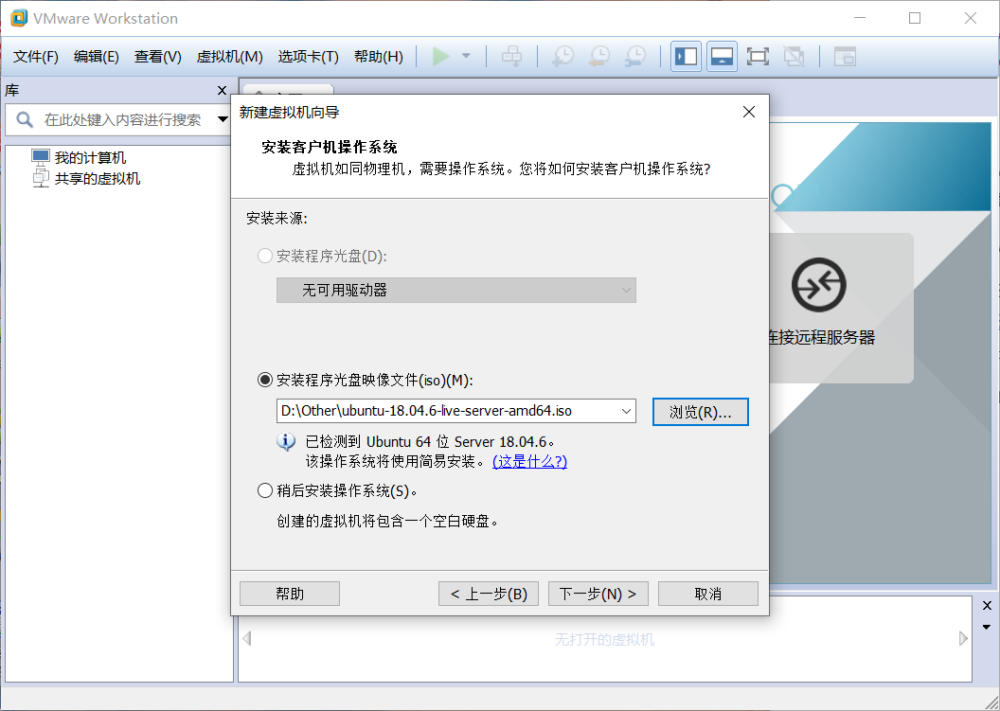
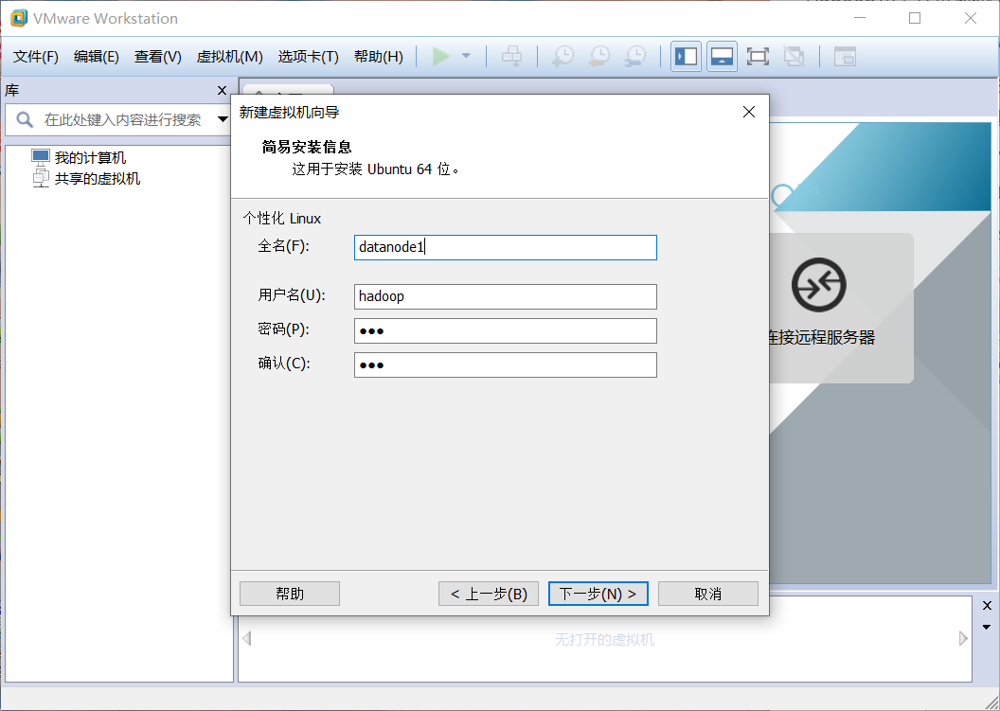
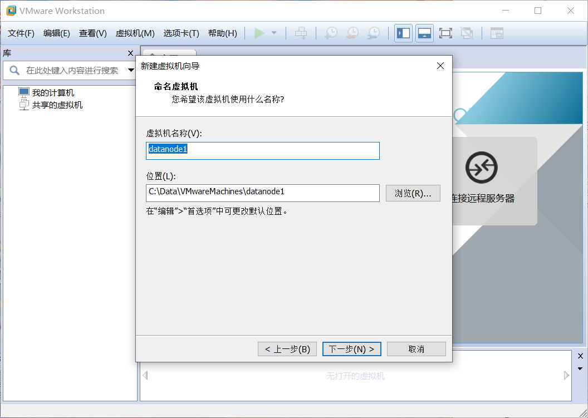
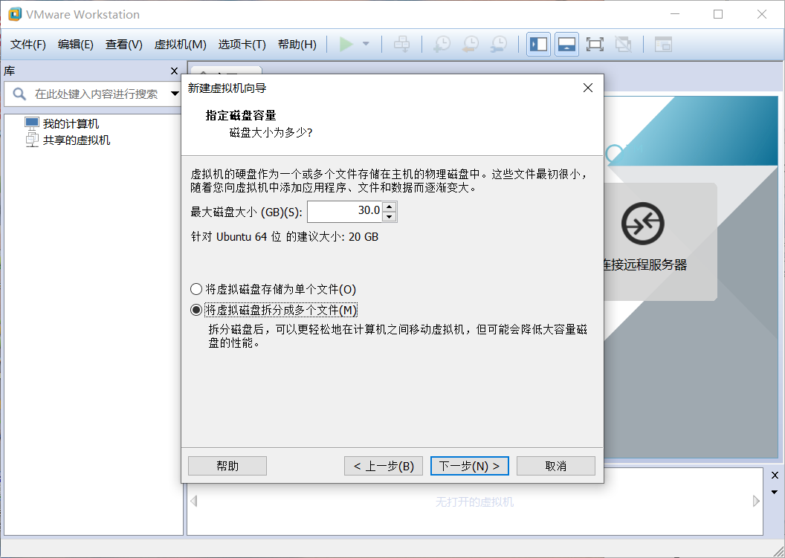
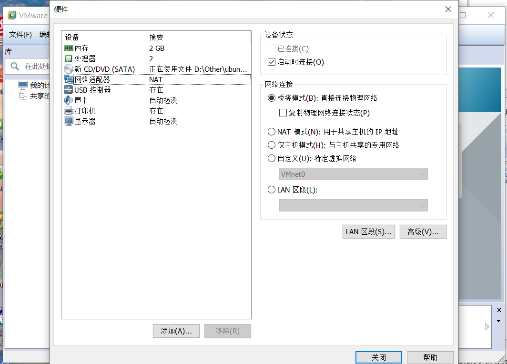
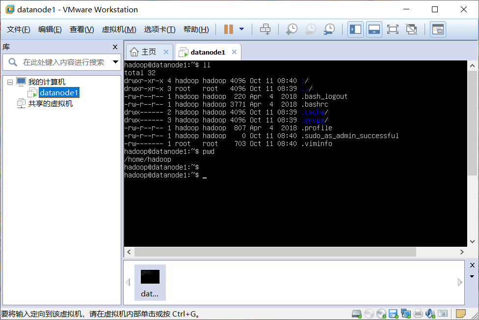
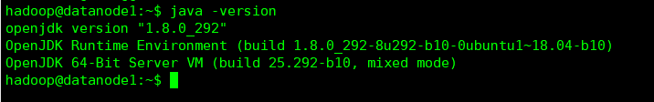

# Hadoop和Spark集群环境搭建

本教程演示如何在win10环境下使用VMware WorkStation虚拟化软件来构建三个虚拟机来搭建Hadoop完全分布式环境。首先会在一台虚拟机中配置好相关的Hadoop和Spark环境，然后使用这台机器拷贝另外两台虚拟机，然后修改相关配置和配置ssh免密通信即可，这样可以快速实现环境的搭建。

## 一、下载并安装VMware WorkStation软件并破解。

## 二、下载Ubuntu-18.04镜像文件

阿里云镜像网站为：http://mirrors.aliyun.com/ubuntu-releases/18.04.6/ubuntu-18.04.6-live-server-amd64.iso。在这里我们使用的是Ubuntu的服务器版本，是不带用户界面的，所占用空间会小很多。

## 三、在VMware Station中新建虚拟机

1. 新建虚拟机，并选定镜像为刚刚下载的Ubuntu镜像，点击下一步



2. 设置Ubuntu主机名称和用户名



3. 命名虚拟机为datanode1



4. 设置最大磁盘大小为30GB



5. 设置内存为2GB、处理器内核数为2、网络适配器为桥接模式，点击完成



6. 开启虚拟机datanode1，一路选择done，主机名设置为datanode1、用户名为hadoop、密码为123

7. 等待安装完成



## 四、在一台虚拟机的Ubuntu中配置Hadoop和Spark环境

### 1、配置Hadoop环境

#### 1）、下载hadoop-3.2.2文件并解压

进入到 `/home/hadoop/` 目录下，下载hadoop-3.2.2.tar.gz 文件，然后使用 `tar -zxvf hadoop-3.2.2.tar.gz` 进行解压

#### 2）、下载open-jdk8并配置java环境

```shell
#安装open-jdk8
hadoop@datanode1:~$ sudo apt-get install openjdk-8-jdk
#查看是否安装成功
hadoop@datanode1:~$ java -version
```



配置用户环境文件 `~/.bashrc`

```shell
hadoop@datanode1:~$ nano .bashrc
```

在文件的末尾添加如下配置

```shell
export JAVA_HOME=/usr/lib/jvm/java-8-openjdk-amd64
export JRE_HOME=$JAVA_HOME/jre
export CLASSPATH=$CLASSPATH:$JAVA_HOME/lib:$JRE_HOME/lib
export PATH=$PATH:$JAVA_HOME/bin:$JRE_HOME/bin
```

#### 3）、配置静态IP

在Ubuntu18.04中配置静态IP和Ubuntu16.04中不同，使用如下步骤来设置静态IP

```shell
#注意：这里的config文件名可能会不一样，修改该yaml文件即可
hadoop@datanode1:~$ sudo nano /etc/netplan/00-installer-config.yaml
```

修改为如下内容：

```y
# This is the network config written by 'subiquity'
network:
  ethernets:
    ens33:
      dhcp4: no
      addresses: [192.168.2.80/24]
      optional: true
      gateway4: 192.168.2.1
      nameservers:
          addresses: [223.5.5.5,223.6.6.6]
  version: 2
```

其中，设置的静态IP为192.168.2.80，网关为192.168.2.1

设置完保存后，使用下面的命令让设置生效

```shell
#让设置生效
hadoop@datanode1:~$ sudo netplan apply
#查看ip
hadoop@datanode1:~$ ip addr
```

#### 4）、配置hadoop

修改~/.bashrc文件，修改为如下信息

```shell
export JAVA_HOME=/usr/lib/jvm/java-8-openjdk-amd64
export JRE_HOME=/usr/lib/jvm/java-8-openjdk-amd64/jre
export SCALA_HOME=/home/hadoop/scala-2.12.12
export HADOOP_HOME=/home/hadoop/hadoop-3.2.2
export HADOOP_MAPRED_HOME=$HADOOP_HOME
export HADOOP_COMMON_HOME=$HADOOP_HOME
export HADOOP_HDFS_HOME=$HADOOP_HOME
export YARN_HOME=$HADOOP_HOME
export HADOOP_CONF_DIR=$HADOOP_HOME/etc/hadoop
export SPARK_HOME=/home/hadoop/spark-3.1.1
export PATH=$PATH:$HADOOP_HOME/bin:$HADOOP_HOME/sbin:$SCALA_HOME/bin:$SPARK_HOME/bin
export CLASSPATH=.:$JAVA_HOME/lib:$JRE_HOME/lib:$HADOOP_HOME/lib/native:$CLASSPATH
```

#### 5）、配置hadoop需要的一些目录

在hadoop-3.2.2目录下建立执行一下命令，建立以下目录。

```shell
mkdir tmp
mkdir hdfs
mkdir hdfs/name
mkdir hdfs/data
mkdir mapred
mkdir mapred/system
mkdir mapred/local
```

这些目录在后续的配置文件中，会出现。

6）