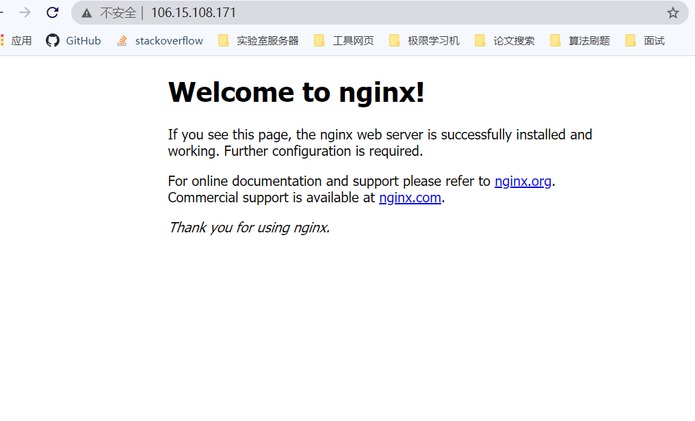

# CentOS8下安装与配置Nginx-1.18.0

```bash
#官网下载Nginx安装包
[$~] cd /usr/local/src
[$/usr/local/src]  wget -c https://nginx.org/download/nginx-1.18.0.tar.gz

#解压
[$/usr/local/src] tar -zxvf nginx-1.18.0.tar.gz 

#下载相关依赖包
[$/usr/local/src] yum -y install make pcre pcre-devel zlib zlib-devel openssl openssl-devel gcc-c++ libtool

#安装nginx
[$/usr/local/src] cd nginx-1.18.0/
[$/usr/local/src/nginx-1.18.0] ./configure
[$/usr/local/src/nginx-1.18.0] make && make install

#进入nginx目录下
[$/usr/local/src/nginx-1.18.0] cd /usr/local/nginx

#开启nginx服务
[$/usr/local/nginx] sbin/nginx
```

**验证安装成功：访问本机IP，默认监听80端口**



至此，nginx安装成功，可以在`/usr/local/nginx/conf/nginx.conf`中对nginx进行配置

主要包括四种配置：

1. 反向代理

   ```bash
   #配置自定义反向代理(~表示正则表达式中包含/wit/的请求)
   location ~ /wit/ {
      proxy_pass http://localhost:8080;
   }
   location ~ /edu/ {
      proxy_pass http://localhost:8081;
   }
   ```

   

2. 负载均衡

   ```bash
   http {
       ...
       
       #负载均衡（默认是轮询策略，即轮流地一次8080一次8081）
       upstream balanceserver{
            server 122.51.127.11:8080;
          	 server 122.51.127.11:8081;
       }
   	server {
   		listen       80;
           server_name  localhost;
   
           location / {
               root   html;
               index  index.html index.htm;
               proxy_pass http://balanceserver;
       }
    }
   ```

   

3. 动静分离

   ```bash
   #配置动静分离(可以通过nginx访问本机目录下/data/images/里的文件)
   location ~ /www/ {
       root /data/;
   }
   location ~ /images/ {
       root /data/;
       autoindex on;
   }
   ```

   

4. 高可用主从备份

   ```bash
   #配置高可用需要在多台服务器上安装上keepalived、nginx和一个虚拟IP
   
   #安装keepalived
   [$~] yum install keepalived -y
   #配置keepalived
   [$~] cd /etc/keepalived
   [$ /etc/keepalived] nano keepalived.conf
   ```

   