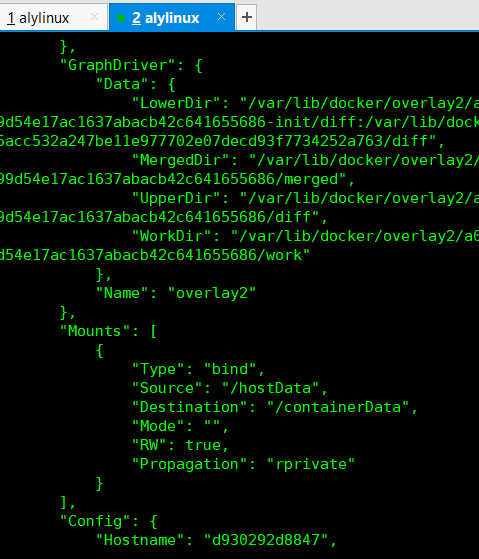
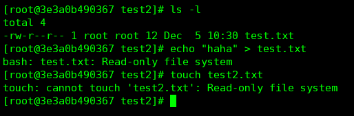
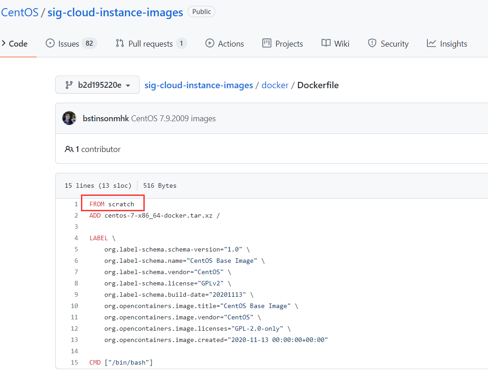
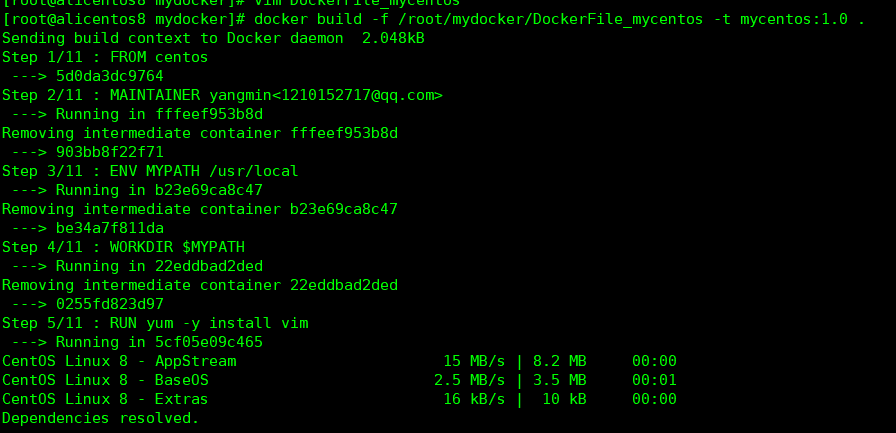
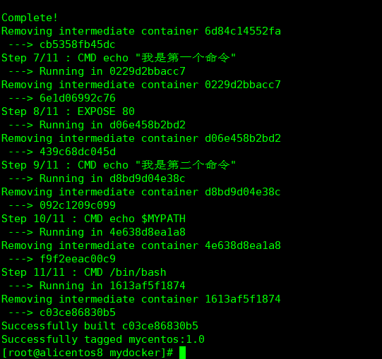
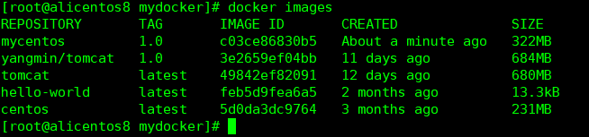
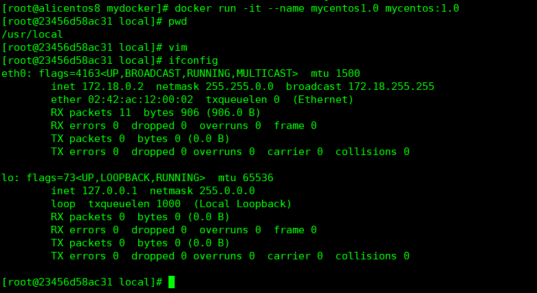
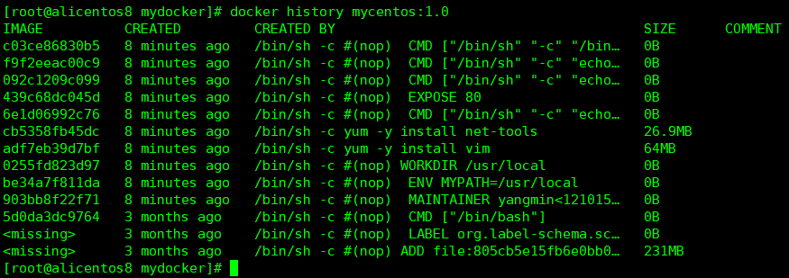
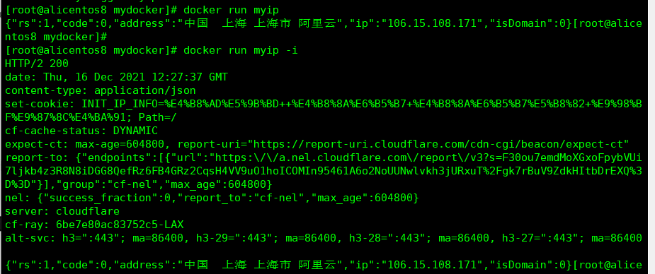
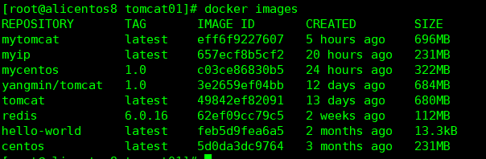

# docker基础

## 一、docker是什么？

docker可以看成是一个精简版的虚拟机，它可以将一个个容器运行在宿主机上，相比传统虚拟机：

|                    | docker | 传统虚拟机VMWare |
| :----------------: | :----: | :--------------: |
|   完整的操作系统   | 不需要 |       需要       |
|   完整的一套硬件   | 不需要 |       需要       |
| 一个centos镜像大小 |  170M  |        4G        |

使用docker可以相比于虚拟机更少的内存和空间占用，将应用程序依赖的环境安装在docker中，可以==实现一次安装到处运行==的效果。可以直接利用宿主机的操作系统来运行一个个容器。

## 二、docker中的重要概念

DockerFile、镜像、仓库、容器

DockerFile：用来构建镜像的源代码文件

镜像：相当于一个个Class，可以根据镜像来创建一个个容器。

仓库：集中存放镜像文件的场所。（DockerHub、阿里云、网易云）

容器：是使用镜像创建的运行实例。它可以被启动、停止、删除。每一个容器都是相互隔离的、保证安全的平台。可以将容器看作是==一个简易版的Linux环境（包含root用户权限、进程、用户、网络空间）和运行在其中的应用程序==。

==镜像和容器的关系就像是Class和实例之间的关系==

## 三、docker安装配置

1、安装可以去Docker官网查看具体过程

2、配置阿里云镜像

centos7的docker配置文件 /etc/docker/daemon.json

```json
{
"registry-mirrors": ["https://k2k55qqz.mirror.aliyuncs.com"]
}
```

配置完成后，使用 service docker restart让配置生效

## 四、docker基本使用

### 1）帮助命令

```bash
# 帮助命令
docker --help
docker command --help
# docker信息
docker info
```

### 2）镜像命令

```bash
# 查看本地的镜像
docker images
# 查看本地的镜像（分层的）
docker images -a
# 查看本地的镜像（只返回镜像ID）
docker images -q

# 查看镜像列表
docker search tomcat

# 拉取镜像，如果不指定版本信息，默认等价于 docker pull tomcat:lastest
docker pull tomcat
# 删除单个镜像
docker rmi tomcat:lastest(或者是镜像ID)
# 删除多个镜像
docker rmi 镜像1:TAG1 镜像2:TAG2 镜像3:TAG3
# 或者
docker rmi $(docker images -qa)
#其中，可以看到$(docker images -q)的输出是一个镜像ID的数组
[root@alicentos8 ~]# echo $(docker images -q)
49842ef82091 feb5d9fea6a5
```

### 3）容器命令

```bash
# 新建并启动容器(-it表示以交互式方式启动容器，--name表示给容器取名字)
docker run -it --name mycentos centos 

# 查看当前正在运行的容器
docker ps
# 历史所有运行过的容器
docker ps -a
# 历史运行过的4个容器
docker ps -n 4

#从容器中的交互窗口退出的两种方式
1. exit (表示从容器中退出并关闭容器)
2. ctrl + P + Q (表示退出容器但是不关闭容器)
# 在没关闭容器时想重新进入容器中
docker attach 容器ID或name
或者
docker exec -it 容器名 /bin/bash
# 不进入到容器中，但是就可以在容器中执行命令
docker exec -t 容器名 cmd

# 启动容器
docker start 容器ID或name
# 启动容器并进入到交互窗口
docker start -i 容器ID或name

# 停止容器
docker stop 容器ID或name

# 重启容器
docker restart 容器ID或name

# 删除未在运行状态中的容器
docker rm 容器ID或name
# 一次性删除多个容器
docker rm $(docker ps -aq)
#或者
docker ps -aq | xargs docker rm

# 输出当前容器的日志信息(-t 时间信息，-f实时更新，--tail 5最后5行日志)
docker logs -t -f --tail 5 mycentos
```

#### 1、将容器中的文件和宿主机上的文件进行相互传输

```bash
docker cp 容器名:路径 宿主机路径
docker cp 宿主机路径 容器名:路径
```

==在容器运行过程中生成的数据在容器关闭退出后，仍然会保存在容器中，可以将他们拷贝到宿主机中保存。==

#### 2、后台运行容器的三种方式

在使用 `docker run -d`在后台运行容器时，如果没有前台进程，容器会马上进入 退出状态（exited），所以必须有一个一直运行着的进程或者挂起的进程（如sleep或ping）

```bash
# 新建并在后台运行容器
docker run -itd --name mycentos centos

# 一直运行睡眠命令让容器不要自动关闭
docker run -d --name mycentos sleep 999999999999

# 新建并启动容器，进入交互界面后使用 ctrl + P + Q暂时退出容器，让容器进入后台运行状态
docker run -it --name mycentos centos
```

#### 3、在docker运行Tomcat提供服务

1）拉取tomcat镜像文件

```bash
docker pull tomcat
```

2）生成tomcat容器，并将本机的8888端口映射到docker中tomcat的8080端口（注意：==这里的8888一定要在阿里云开放端口==）

```bash
docker run -it -p 8888:8080 --name mytomcat tomcat
# 其中-p 后面是 本机端口:docker中端口
#可以使用 -P会随机生成一个本机端口
```

3）在新的终端中进入到容器中

```bash
# 使用这种方式重新进入容器后，使用exit退出容器时不会关闭容器；使用ctrl+P+Q不会退出容器
docker exec -it mytomcat /bin/bash
```

4）在web页面中使用 `localhost:8888/`访问tomcat首页，如果不能出现首页，是因为默认首页中的文件都是在 `webapps`目录下的，可是docker中的tomcat中的webapps目录是空的，首页文件都在webapps.dists，可以先将webapps.dists目录里的文件都拷贝到webapps下，就可以访问了 

#### 4、将官方Tomcat镜像内的文件修改后，生成自己的tomcat镜像

在上一步中，为了使用 `localhost:8080/`直接访问到tomcat首页，就将webapp.dists文件夹中的文件都拷贝到了webapps中。

由于不希望每次使用官方的tomcat时都要做一遍这个操作，所以可以将修改完成后的容器生成一个自己的tomcat镜像，具体步骤如下：

上一步容器的名称是 mytomcat

```bash
# docker commit -m="概述信息" -a="作者" 容器名或容器ID 自己的镜像名:tag
docker commit -m="my changed tomcat" -a="yangmin" mytomcat yangmin/tomcat:1.0
```

再使用 `docker images`就可以看到自己生成的镜像，使用该镜像文件生成容器时，就会已改好的tomcat为基础啦

## 五、docker数据卷

数据卷就是文件或者目录，存在于一个或者多个容器之中，由docker挂载到容器中。数据卷设计的目的就是为了数据的持久化，删除容器时不会删除数据卷。

特点：

1. 数据卷可以在多个容器之间共享和重用数据
2. 卷中的更改可以直接生效
3. 数据卷中的更改不会包含在镜像的更新中
4. 数据卷的生命周期会一直持续到没有容器使用它为止

### 1）使用数据卷让宿主机和容器数据共享

```bash
# 基本命令
docker run -it -v /宿主机目录:/容器目录 镜像名称或ID
```

```bash
# 在宿主机和centos容器之间构建文件共享
docker run -it -v /hostData:/containerData --name mycentos centos
```

在容器根目录下会生成一个 `containerData`文件夹，在宿主机根目录下会生成一个 `hostData`文件夹。在`hostData`中添加或者修改文件时，可以实时在`containerData`中看到。

可以使用命令 `docker inspect 容器名或ID`查看当前容器状态，发现数据卷是可读可写的，而且容器中的数据卷和宿主机的数据卷建立了关联。



默认情况下，数据卷是可读可写的，但是也可以设置数据卷是只读的。

这里的只读，是指==在容器内不可以对数据卷中的文件进行添加或者修改==，==在宿主机依旧可以对文件进行修改或添加。==



### 2）容器之间传递共享数据卷(--volumes-from，注意是两个-)

```bash
# 创建第一个容器dc01，其中有数据卷目录 /containterData
docker run -it --name dc01 centos
# 创建第二个容器dc02继承自dc01
docker run -it --name dc02 --volumes-from dc01 centos
# dc01和dc02此时是使用的同一个数据卷，在数据卷中添加或者修改数据，在各个容器中都能看得到
# 并且，即使删除掉dc01容器，在dc02中依旧可以看到数据卷中的数据
# 数据卷直到没有任何容器访问时，才会结束其生命周期
```

## 六、DockerFile

==DockerFile：是用来构建Docker镜像的构建文件，是由一系列命令和参数构成的脚本。==

使用DockerFile的步骤：

1. 手动编写一个DockerFile文件，必须符合file规范
2. 使用 `docker build`命令来获得一个==自定义的镜像==
3. 使用 `docker run`命令来生成并运行一个==容器==

### 1）元镜像

所有docker镜像的最基础镜像（元镜像）都是：==scratch==，相当于Java中的Object类，可以在centos的DockerFile中看到



### 2）DockerFile的基础知识

DockerFile编写规范（语法）：

1. 每条保留字指令都必须是大写字母，并且后面必须要跟随至少一个参数
2. 指令按照从上到下，顺序执行
3. \# 表示注释
4. 每条指令都会创建一个新的镜像层，并对镜像进行提交

### 3）DockerFile的执行流程

1. docker从基础镜像运行一个镜像
2. 执行一条指令并对容器进行修改
3. 执行类似docker commit的操作提交一个新的镜像层
4. docker再基于刚提交的镜像运行一个新的容器
5. 执行DockerFile中的下一条指令直到所有指令都执行完成

### 4）DockerFile中的保留关键字

- FROM：基础镜像，当前新镜像是基于哪个镜像的

- MAINTAINER：维护者（作者）

- RUN：容器构建时需要运行的linux命令

- EXPOSE：容器向外暴露的端口号

- WORKDIR：指定在创建容器后，终端默认登陆进来的工作目录，一个落脚点

- ENV ：用来在构建镜像的过程中设置环境变量

- ADD：和COPY类似，将当前DockerFile目录下的某些文件==拷贝并解压==到镜像文件中

- COPY：将当前DockerFile目录下的某些文件==拷贝==到镜像文件中

- VOLUME：创建容器数据卷，用于持久化保存数据

- CMD：指定一个容器启动时需要执行的命令（==注意：一个DockerFile文件中可以有多个CMD命令，但只有最后一个会生效，CMD会被 docker run 之后的参数所替换==）

- ENTRYPOINT：指定一个容器启动时需要执行的命令，==ENTRYPOINT不会被 docker run 之后的参数所替换，而是追加==

- ONBUILD：当子类的DockerFile被构建时，父类DockerFile中的ONBUILD后面跟着的命令将会被执行，如（ONBUILD RUN echo "hahah"）

  ```dockerfile
  # 父类镜像 img_father
  FROM centos
  ONBUILD RUN echo "hahah"
  
  # 使用docker build构建镜像为 img_father
  
  # 子类镜像 img_son
  FROM img_father
  RUN echo "yeyeyey"
  
  #在使用docker build构建img_son时，就会执行命令 RUN echo "hahah"
  # 相当于是一个触发器
  ```

### 5）通过编写DockerFile自定义镜像文件

1、自定义centos ：已最近的centos为基础镜像构建mycentos:1.0

需求分析：

①运行后的工作目录在 `/usr/local/`目录下

②新的centos中需要使用 `vim` 和 `ifconfig` 命令

③向外暴露 80 端口

④默认进入到 `/bin/bash` 中

⑤作者信息为：yangmin\<1210152717@qq.com\>

```dockerfile
FROM centos:lastest
MAINTAINER yangmin<1210152717@qq.com>
ENV MYPATH /usr/local
WORKDIR $MYPATH
RUN yum -y install vim
RUN yum -y install net-tools
CMD echo "我是第一个命令"
EXPOSE 80
CMD echo "我是第二个命令"
CMD echo $MYPATH
CMD /bin/bash
```

2、开始构建镜像：（注意后面有个 `.`，代表当前目录 ）

```bash
docker build -f /root/mydocker/DockerFile_mycentos -t mycentos:1.0 .
```





3、 使用`docker images`可以看到已经构建好的镜像 



4、运行构建好的镜像文件，生成一个容器

```bash
docker run -it --name mycentos1.0 mycentos:1.0
```

可以看到当前目录在 `/usr/local`下，并且 `vim` 和 `ifconfig`命令都是可以用的



5、可以使用 `docker history 镜像ID `  查看镜像构建历史



### 6）CMD和ENTRYPOINT的区别

CMD和ENTRYPOINT都是指定容器启动时要运行的命令，但是：

CMD只会执行最后面的那一个，而且会被 `docker run 镜像ID cmd` 里的cmd所替换掉

```bash
# 例如在Tomcat的DockerFile中最后用来启动tomcat的是一句
# CMD ["catalina.sh","run"]
# 如果启动tomcat容器的命令变成 docker run -it tomcat ls -l
# 那么 ls -l将会替换掉CMD ["catalina.sh","run"]，tomcat会启动失败
```

ENTRYPOINT会将当前命令执行，并且将cmd里的内容追加到原有命令后面；

```bash
# 例如，在DockerFile中最后一个命令是：
# ENTRYPOINT ["curl","-s","https://ip.cn/api/index?type=0"]
# 正常情况下，构建镜像并运行容器，将会返回json串，也就是本地的IP信息
# 如果还想要返回请求头信息，在curl 后面需要添加 -i 参数
# 如果是CMD则会被 -i 覆盖掉，但是ENTRYPOINT就可以追加 -i在后面，组成
curl -s https://ip.cn/api/index?type=0 -i
# 成功返回信息
docker run myip -i
```



### 7）创建自定义tomcat镜像

#### ①准备工作：

1. 下载必要的压缩包 `apache-tomcat-9.0.56.tar.gz`，`jdk-8u151-linux-x64.tar.gz`
2. 将这两个压缩包放在和编写的DockerFile_mytomcat相同的目录下

#### ②编写DockerFile_mytomcat

```dockerfile
# 基础镜像是centos
FROM centos
# 维护者（开发者）姓名和邮箱
MAINTAINER yangmin<1210152717@qq.com>
# 设置环境变量MYPATH
ENV MYPATH /usr/local
WORKDIR $MYPATH
# 安装vim
RUN yum -y install vim
# 拷贝并解压tomcat和jdk到镜像中的工作目录中
ADD apache-tomcat-9.0.56.tar.gz $MYPATH
ADD jdk-8u151-linux-x64.tar.gz $MYPATH
# 只拷贝test.txt到镜像中的工作目录中
COPY test.txt $MYPATH

# 配置环境变量
ENV CATALINA_BASE=$MYPATH/apache-tomcat-9.0.56
ENV CATALINA_HOME=$MYPATH/apache-tomcat-9.0.56
# 注意这里jdk-8u151-linux-x64.tar.gz解压后的目录名称是jdk1.8.0_151，而不是jdk-8u151-linux-x64
ENV JAVA_HOME=$MYPATH/jdk1.8.0_151
ENV CLASSPATH=.:$JAVA_HOME/lib/dt.jar:$JAVA_HOME/lib/tools.jar
ENV PATH=$PATH:$JAVA_HOME/bin:$CATALINA_HOME/bin:$CATALINA_HOME/lib

#暴露8080端口
EXPOSE 8080

# 运行tomcat
CMD $MYPATH/apache-tomcat-9.0.56/bin/startup.sh && tail -F $MYPATH/apache-tomcat-9.0.56/bin/logs/catalina.out
```

#### ③根据DockerFile文件来构建镜像

```bash
docker build -f DockerFile_mytomcat -t mytomcat . 
```

#### ④根据mytomcat生成并运行容器

创建两个数据卷，用来在宿主机发布web应用和查看日志

首先在宿主机上创建两个目录：（==考虑在mytomcats目录下可以实现多个tomcat发布==）

```bash
mkdir -p mytomcats/tomcat01/webapps
mkdir -p mytomcats/tomcat01/logs
```

- /root/mydocker/mytomcats/tomcat01/webapps ：发布web应用
- /root/mydocker/mytomcats/tomcat01/logs：查看日志

==直接将`/root/mydocker/mytomcats/tomcat01/webapps:/usr/local/apache-tomcat-9.0.56/webapps`映射的话，会以宿主机里的目录为准。如果宿主机里的webapps目录是空的，那么容器里的`/usr/local/apache-tomcat-9.0.56/webapps`目录会被清空==

```bash
# 把本地的webapps映射到容器的webapps/test 目录下，这样就不会将容器中的webapps目录里的其他文件给删掉，但是访问的时候要加http://ip/test/test.txt
docker run -d --name mytomcat01 -p 8080:8080 -v /root/mydocker/mytomcats/tomcat01/webapps:/usr/local/apache-tomcat-9.0.56/webapps/test -v /root/mydocker/mytomcats/tomcat01/logs:/usr/local/apache-tomcat-9.0.56/logs mytomcat
```

```bash
# 把本地的webapps映射到容器的webapps/ROOT 目录，这样就可以http://ip/test.txt
docker run -d --name mytomcat01 -p 8080:8080 \
-v /root/mydocker/mytomcats/tomcat01/webapps:/usr/local/apache-tomcat-9.0.56/webapps/ROOT \
-v /root/mydocker/mytomcats/tomcat01/logs:/usr/local/apache-tomcat-9.0.56/logs \
mytomcat
```

```bash
# 使用断行
docker run -d --name mytomcat03 -p 8082:8080 \
-v /root/mydocker/mytomcats/tomcat03/webapps:/usr/local/apache-tomcat-9.0.56/webapps/ROOT \
-v /root/mydocker/mytomcats/tomcat03/logs:/usr/local/apache-tomcat-9.0.56/logs \
mytomcat
```

### 8）使用官方的Redis镜像来构建容器

#### ①拉取redis:6.0.16的镜像文件

```bash
docker pull redis:6.0.16
```

#### ②使用docker来启动redis并使用自己的配置文件

==这里注意：==

redis.conf 中的配置项 `daemonize no`，意思是是否以守护进程的方式启动；==如果改成`yes`那么使用docker启动redis容器时会失败==

redis.conf 中配置的 `log、pidfile`等路径==需要在当前用户有权限创建的地方，或者直接设置成 ""==

```bash
docker run -d --privileged=true -p 6380:6379  \
> -v /root/mydocker/myredis/redis01/data/:/data \
> -v /root/mydocker/myredis/redis01/conf/redis.conf:/usr/local/etc/redis/redis.conf \
> --name redis redis:6.0.16 \
> redis-server /usr/local/etc/redis/redis.conf

# 使用容器卷将redis容器中的数据备份到宿主机中，并且将宿主机中的配置文件与容器中的配置文件相映射
# 最后一句是使用 redis-server /usr/local/etc/redis/redis.conf 来代替原来的启动方式
# 在最后面还可以使用 --appendonly yes的方式在命令行修改配置
```

#### ③ 进入到redis容器中操作redis

```bash
# 进入容器中
docker exec -it redis /bin/bash
# 使用redis-cli
redis-cli
# 验证密码后操作redis
auth ****
```


## 七、将本地镜像上传到阿里云



任务：将本地的`mycentos:1.0`上传到阿里云上去，可以供自己或者其他人以后下载使用

#### ①创建自己的仓库和命名空间 

[容器镜像服务](https://cr.console.aliyun.com/cn-hangzhou/instances)

#### ②登陆自己的账号，输入密码

 `docker login --username=15271824272 registry.cn-hangzhou.aliyuncs.com`

#### ③将镜像推送到Registry

```
$ docker login --username=152****4272 registry.cn-hangzhou.aliyuncs.com
$ docker tag [ImageId] registry.cn-hangzhou.aliyuncs.com/ymccc/ym_repository:[镜像版本号]
$ docker push registry.cn-hangzhou.aliyuncs.com/ymccc/ym_repository:[镜像版本号]
```

#### ④详细操作

[容器镜像服务 (aliyun.com)](https://cr.console.aliyun.com/repository/cn-hangzhou/ymccc/mycentos/details)

