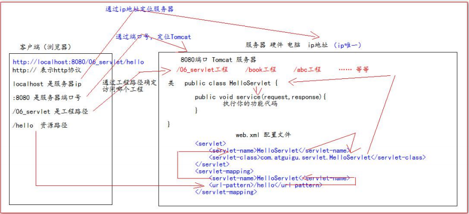
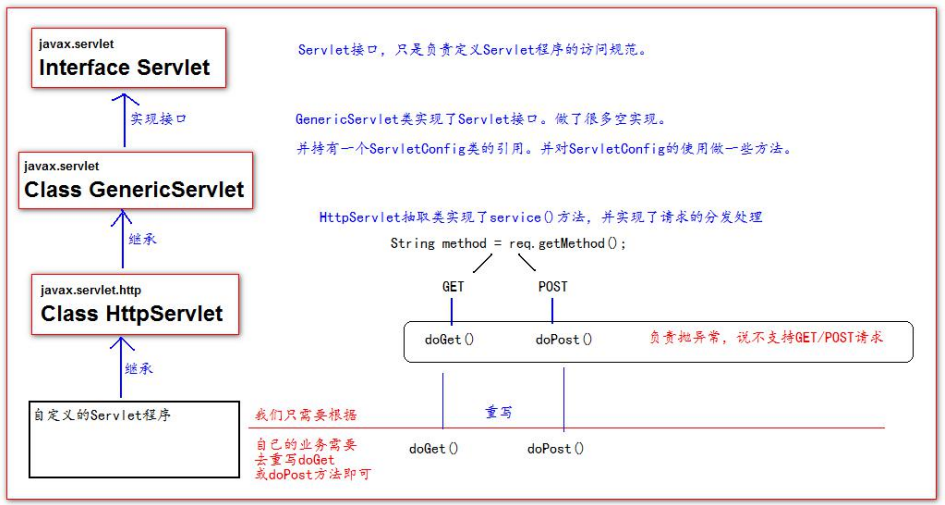

# Servlet相关知识:coffee:

## 1、Selvlet是什么？

Servlet是JavaWeb三大组件（Servlet，Filter，Listener）之一，==本质上是一个运行在服务器上的一个Java小程序，它可以接受客户端发送过来的请求，并响应数据给服务端==。


## 2、实现Servlet程序的方式

### 2.1、==实现==Servlet接口

1)、继承Servlet接口

2)、实现` service(ServletRequest servletRequest, ServletResponse servletResponse) `方法，处理请求，响应数据

3)、在web.xml中配置Servlet程序的访问地址

```java
//1.创建HelloServlet继承Servlet接口
public class HelloServlet implements Servlet {
/**
* service 方法是专门用来处理请求和响应的
*/
@Override
	public void service(ServletRequest servletRequest, ServletResponse servletResponse) throws
ServletException, IOException {
		System.out.println("3 service === Hello Servlet 被访问了");
		// 类型转换（因为只有HttpServletRequest有getMethod()方法）
		HttpServletRequest httpServletRequest = (HttpServletRequest) servletRequest;
		// 获取请求的方式
		String method = httpServletRequest.getMethod();
		if ("GET".equals(method)) {
			doGet();
		} else if ("POST".equals(method)) {
			doPost();
		}
	}
    
    public void doGet(){
		System.out.println("get 请求");
		System.out.println("get 请求");
	}
    public void doPost(){
		System.out.println("post 请求");
		System.out.println("post 请求");
	}
}
```

```xml
<!--2.配置web.xml-->
<?xml version="1.0" encoding="UTF-8"?>
<web-app xmlns="http://xmlns.jcp.org/xml/ns/javaee"
	xmlns:xsi="http://www.w3.org/2001/XMLSchema-instance"
	xsi:schemaLocation="http://xmlns.jcp.org/xml/ns/javaee
	http://xmlns.jcp.org/xml/ns/javaee/web-app_4_0.xsd"
	version="4.0">
	<!-- servlet 标签给 Tomcat 配置 Servlet 程序 -->
	<servlet>
		<!--servlet-name 标签 Servlet 程序起一个别名（一般是类名） -->
		<servlet-name>HelloServlet</servlet-name>
		<!--servlet-class 是 Servlet 程序的全类名-->
		<servlet-class>com.atguigu.servlet.HelloServlet</servlet-class>
	</servlet>
	<!--servlet-mapping 标签给 servlet 程序配置访问地址-->
	<servlet-mapping>
		<!--servlet-name 标签的作用是告诉服务器，我当前配置的地址给哪个 Servlet 程序使用-->
		<servlet-name>HelloServlet</servlet-name>
		<!--url-pattern 标签配置访问地址 <br/>
		/ 斜杠在服务器解析的时候，表示地址为：http://ip:port/工程路径 <br/>
		/hello 表示地址为：http://ip:port/工程路径/hello <br/>
		-->
		<url-pattern>/hello</url-pattern>
	</servlet-mapping>
</web-app>
```

### 2.2、==继承==HttpServlet类

1)、编写一个类继承HttpServlet类

2)、根据业务来重写doGet和doPost方法

3)、在web.xml中配置Servlet程序的访问路径

```java
//1.使用HelloServlet2继承HttpServlet类
public class HelloServlet2 extends HttpServlet {
	/**
	* doGet（）在 get 请求的时候调用
	*/
	@Override
	protected void doGet(HttpServletRequest req, HttpServletResponse resp) throws ServletException,
	IOException {
		System.out.println("HelloServlet2 的 doGet 方法");
	}
	/**
	* doPost（）在 post 请求的时候调用
	*/
	@Override
	protected void doPost(HttpServletRequest req, HttpServletResponse resp) throws ServletException,
	IOException {
		System.out.println("HelloServlet2 的 doPost 方法");
	}
}
```

```xml
<!--2.配置web.xml-->
<servlet>
	<servlet-name>HelloServlet2</servlet-name>
	<servlet-class>com.atguigu.servlet.HelloServlet2</servlet-class>
</servlet>
<servlet-mapping>
	<servlet-name>HelloServlet2</servlet-name>
	<url-pattern>/hello2</url-pattern>
</servlet-mapping>
```


## 3、从URL到Servlet程序的访问过程



URL：http://localhost:8080/myproject/hello

1)、使用IP --> `localhost`确定服务器位置

2)、使用端口8080确定Tomcat应用程序

3)、使用工程路径 `/myproject` 确定Tomcat下具体是哪个项目

4)、使用资源路径`/hello`根据web.xml中的Servlet配置找到对应的Servlet程序


## 4、Servlet的生命周期

1)、执行Servlet的构造方法

2)、执行init初始化方法

==第1、2步只会在第一次访问该Servlet时执行一次==

3)、执行service方法==（每次调用该Servlet时都会执行）==

4)、执行destroy销毁方法 ==(在web工程停止时调用)==


## 5、Servlet的继承体系




## 6、ServletConfig 类

ServletConfig 类是 Servlet 程序的==配置信息类==。 ==Servlet 程序和 ServletConfig 对象都是由 Tomcat 负责创建==， 一个Servlet程序在第一次被访问时就创建一个Servlet对象和其对应的ServletConfig对象。==Servlet对象中包含一个ServletConfig对象==

### 6.1、ServletConfig类的作用

1)、可以获取 Servlet 程序的别名 servlet-name 的值 

2)、获取初始化参数 init-param

3)、获取 ServletContext 对象

对于获取初始化init-param参数，web.xml配置为

```xml
<servlet>
	<!--servlet-name 标签 Servlet 程序起一个别名（一般是类名） -->
	<servlet-name>HelloServlet</servlet-name><!--servlet-class 是 Servlet 程序的全类名-->
	<servlet-class>com.atguigu.servlet.HelloServlet</servlet-class>
	<!--init-param 是初始化参数-->
	<init-param>
		<!--是参数名-->
		<param-name>username</param-name>
		<!--是参数值-->
		<param-value>root</param-value>
	</init-param>
	<!--init-param 是初始化参数-->
	<init-param>
		<!--是参数名-->
		<param-name>url</param-name>
		<!--是参数值-->
		<param-value>jdbc:mysql://localhost:3306/test</param-value>
	</init-param>
</servlet>
<!--servlet-mapping 标签给 servlet 程序配置访问地址-->
<servlet-mapping>
	<!--servlet-name 标签的作用是告诉服务器，我当前配置的地址给哪个 Servlet 程序使用-->
	<servlet-name>HelloServlet</servlet-name>
	<!--
	url-pattern 标签配置访问地址 <br/>
	/ 斜杠在服务器解析的时候，表示地址为：http://ip:port/工程路径 <br/>
	/hello 表示地址为：http://ip:port/工程路径/hello <br/>
	-->
	<url-pattern>/hello</url-pattern>
</servlet-mapping>
```

Servlet中代码为：

```java
//init方法只会在第一次访问该Servlet程序时执行一次
@Override
public void init(ServletConfig servletConfig) throws ServletException {
    //这里一定要调用父Servlet中的init方法
    super.init(servletConfig);
	System.out.println("2 init 初始化方法");
	// 1、可以获取 Servlet 程序的别名 servlet-name 的值
	System.out.println("HelloServlet 程序的别名是:" + servletConfig.getServletName());
	// 2、获取初始化参数 init-param
	System.out.println("初始化参数 username 的值是;" + servletConfig.getInitParameter("username"));
	System.out.println("初始化参数 url 的值是;" + servletConfig.getInitParameter("url"));
	// 3、获取 ServletContext 对象
	System.out.println(servletConfig.getServletContext());
}
```

==注意点：一定要调用父Servlet中的init方法super.init(servletConfig);==


## 7、ServletContext 类

1)、ServletContext 是==一个接口==，它表示 Servlet 上下文对象 

2)、一个 web 工程，只有一个 ServletContext 对象实例 

3)、ServletContext 对象是一个域对象

4)、ServletContext 是在 ==web 工程部署启动的时候创建，在 web 工程停止的时候销毁==

==什么是域对象?==

域对象，是可以像 Map 一样存取数据的对象，叫域对象。 ==域指的是存取数据的操作范围==

**ServletContext的四个作用**

1)、获取 web.xml 中配置的上下文参数 context-param 

2)、获取当前的工程路径，格式: /工程路径 

3)、获取工程部署后在服务器硬盘上的绝对路径

4)、像 Map 一样存取数据

代码示例：

```java
protected void doGet(HttpServletRequest request, HttpServletResponse response) throws
ServletException, IOException {
	// 1、获取 web.xml 中配置的上下文参数 context-param
	ServletContext context = request.getServletConfig().getServletContext();
	String username = context.getInitParameter("username");
	System.out.println("context-param 参数 username 的值是:" + username);
	System.out.println("context-param 参数 password 的值是:" + context.getInitParameter("password"));
	// 2、获取当前的工程路径，格式: /工程路径System.out.println( "当前工程路径:" + context.getContextPath() );
	// 3、获取工程部署后在服务器硬盘上的绝对路径
	/**
	* / 斜杠被服务器解析地址为:http://ip:port/工程名/ 映射到 IDEA 代码的 web 目录<br/>
	*/
	System.out.println("工程部署的路径是:" + context.getRealPath("/"));
	System.out.println("工程下 css 目录的绝对路径是:" + context.getRealPath("/css"));
	System.out.println("工程下 imgs 目录 1.jpg 的绝对路径是:" + context.getRealPath("/imgs/1.jpg"));
    //4.像map一样存取数据
    context.setAttribute("mydata","hello");
    String data = (String)context.getAttribute("mydata");
}
```

web.xml中配置

```xml
<!--context-param 是上下文参数(它属于整个 web 工程)-->
<context-param>
	<param-name>username</param-name>
	<param-value>context</param-value>
</context-param>
<!--context-param 是上下文参数(它属于整个 web 工程)-->
<context-param>
	<param-name>password</param-name>
	<param-value>root</param-value>
</context-param>
```

## 8、解决请求、响应中文乱码问题

### 8.1、Get请求乱码

```java
//获取请求参数
String username = req.getParameter("username");
//1 先以 iso8859-1 进行编码
//2 再以 utf-8 进行解码
username = new String(username.getBytes("iso-8859-1"), "UTF-8");

//也可以在Tomcat中进行配置
```

### 8.2、Post请求乱码

```java
@Override
protected void doPost(HttpServletRequest req, HttpServletResponse resp) throws ServletException,
IOException {
	// 设置请求体的字符集为 UTF-8，从而解决 post 请求的中文乱码问题
	req.setCharacterEncoding("UTF-8");
	System.out.println("-------------doPost------------");
	// 获取请求参数
	String username = req.getParameter("username");
	String password = req.getParameter("password");
    // 获取多个参数值
	String[] hobby = req.getParameterValues("hobby");
	System.out.println("用户名：" + username);
	System.out.println("密码：" + password);
	System.out.println("兴趣爱好：" + Arrays.asList(hobby));
}
```

### 8.3、响应乱码

```java
//第一种方式（不推荐）
// 设置服务器字符集为 UTF-8
resp.setCharacterEncoding("UTF-8");
// 通过响应头，设置浏览器也使用 UTF-8 字符集
resp.setHeader("Content-Type", "text/html; charset=UTF-8");

//第二种方式(推荐)
// 它会同时设置服务器和客户端都使用 UTF-8 字符集，还设置了响应头 
// 此方法一定要在获取流对象之前调用才有效 （在过滤器中编写）
resp.setContentType("text/html;charset=UTF-8");
```


## 9、请求转发与重定向

### 9.1、请求转发

请求转发是指，服务器收到请求后，从一次资源跳转到另一个资源的操作叫请求转发。

请求转发的特点：

​	1)、浏览器地址不会发生变化

​	2)、==转发请求和当前请求是同一次请求==

​	3)、==两个请求共享Request域中的数据==

​	4)、只能转发到WEB-INF目录下，不能转发到其他网站（www.baidu.com）去

```java
public class Servlet1 extends HttpServlet {
	@Override
	protected void doGet(HttpServletRequest req, HttpServletResponse resp) throws ServletException,
	IOException {
		String username = req.getParameter("username");
		System.out.println(username);
		req.setAttribute("key1","value1");
		/**
		* 请求转发必须要以斜杠打头，/ 斜杠表示地址为：http://ip:port/工程名/ , 映射到 IDEA 代码的 web 目录
		*/
		RequestDispatcher requestDispatcher = req.getRequestDispatcher("/servlet2").forward(req,resp);
		// RequestDispatcher requestDispatcher = req.getRequestDispatcher("http://www.baidu.com");
	}
}

//Servlet2 代码：
public class Servlet2 extends HttpServlet {
	@Override
	protected void doGet(HttpServletRequest req, HttpServletResponse resp) throws ServletException,
	IOException {
        //使用的同一个request对象
		String username = req.getParameter("username");
		System.out.println(username);
		Object key1 = req.getAttribute("key1");
		System.out.println(key1);
		// 处理自己的业务
		System.out.println("Servlet2 处理自己的业务 ");
	}
}
```

### 9.2、请求重定向

请求重定向，是指客户端给服务器发请求，然后服务器告诉客户端说。我给你一些地址。你去新地址访问。叫请求重定向（因为之前的地址可能已经被废弃）

请求重定向的特点：

1)、相当于两次请求

2)、浏览器状态栏会发生改变

3)、不共享Request对象

4)、不能访问WEB-INF下的资源

5)、可以访问其他网站

```java
//1.请求重定向的第一种方案：
// 设置响应状态码 302 ，表示重定向，（已搬迁）
resp.setStatus(302);
// 设置响应头，说明 新的地址在哪里
resp.setHeader("Location", "http://localhost:8080");


//2.请求重定向的第二种方案（推荐使用）：
//参数 location 可以使用相对 URL，Web 服务器会自动将相对 URL 翻译成绝对 URL，再生成 Location 头字段,不过这里的/代表http://ip:port/,不带项目根路径
resp.sendRedirect("http://localhost:8080")
resp.sendRedirect("/project/servlet2")
```


## 10、Web中 `/` 的意义

`/ `斜杠 如果被==浏览器==解析，得到的地址是：http : //ip:port/ 

```html
<a href="/"></a>
```

`/ `斜杠 如果被==服务器==解析得到的地址是：

http: //ip:port/工程路径 

1)、/servlet1 

2)、servletContext.getRealPath(“/”); 

3)、request.getRequestDispatcher(“/”); 

==特殊情况： response.sendRediect(“/”); 把斜杠发送给浏览器解析。得到 http: //ip:port/==


## 11、sessionID生成的时机

```java
//第一次使用HttpServletRequest类的getSession方法时在响应头中会创建一个"set-cookies=JSESSION=****"给客户端

@GetMapping("/user")
    public List<User> getUsers(HttpServletRequest request){
        
        HttpSession session = request.getSession();
        System.out.println(session.isNew());  //第一次true，第二次false；
        System.out.println(session.getId());
        return userService.getUsers();
}
```

