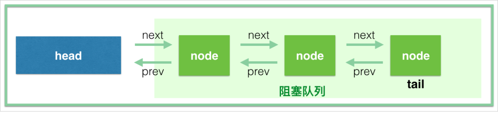

# AQS源码流程解析

## 一、AbstractQueuedSynchronized（AQS）类中的属性

在 `AQS`类中主要有四个属性分别是：

```java
volatile Node head; //可以理解为当前持有锁的线程
volatile Node tail; //阻塞队列的队尾元素
volatile int state; //当前的锁状态，state = 0表示没有线程持有锁，state > 0 表示有线程持有锁（ > 1表示重入次数）
Thread exclusiveOwnThread; //当前持有独占锁的线程
```

## 二、AQS的内部类Node类中的属性

内部类Node主要是为了将每个等待的线程包装成一个Node节点，组成一个阻塞队列（==不包括head，不包括head，不包括head==）

```java
volatile waitStatus; //取值为 -3，-2，-1，0，1（暂时只用管-1，0，1这三个状态：-1表示后继节点需要被唤醒，0表示新建节点，1表示放弃等待的节点）
volatile Node prev; //前驱节点
volatile Node next; //后继节点
volatile Thread thread; //被Node类包装的线程本尊
```



## 三、ReentrantLock公平锁源码解析

在ReentrantLock中是通过继承内部类 `Sync` 来管理锁的，而 `Sync` 继承自 AQS，`FairSync` 继承自 `Sync`。

```java
abstract static class Sync extends AbstractQueuedSynchronizer
    
static final class FairSync extends Sync
```

`FairSync` 的lock()方法源码流程为：

1. 调用 `lock()` 方法后，会调用 `acquire(1)` 方法，然后会使用 `tryAcquire(1)` 尝试获取锁
2. `tryAcquire` 方法会判断锁是否被占用，如果没被占用并且等待队列里没有元素，那么当前线程就使用CAS操作尝试获取锁，获取到后就将自己设置为当前占有锁的线程。如果没有获取到锁或者原来锁就被占用了，那么就判断占有锁的线程是否是当前线程，如果是那么就是锁重入，只需要将state加1即可。否则，就要将当前线程包装为Node节点然后添加到等待队列中去。
3. 使用addWaiter方法将当前线程按独占模式添加到等待队列中去，首先会将当前线程包装为一个Node节点，然后判断当前的尾节点是否为null，如果为null，则说明等待队列还不存在，需要使用CAS操作设置头节点，并将尾节点指向头节点。然后使用CAS尝试将当前节点设置为新的尾节点，如果成功了返回当前节点。如果不成功，就再次尝试初始化头节点和CAS设置尾节点的操作，直到设置成功为止。
4. 判断当前节点是阻塞队列中的第一个节点，那么就可以使用 `tryAcquire(1)`尝试来获取锁，如果获取到了那么就将当前节点设置为头节点，删除原来的头节点。
5. 如果当前节点不是阻塞队列中的第一个节点或者抢锁没有抢赢其他线程，就需要将当前节点插入到阻塞队列中。
6. 如果当前前驱节点的等待状态为 -1，那么直接将当前线程挂起。如果前驱节点的等待状态为大于1，也就是前面的线程取消了等待，那么就要一直往前找，找到一个等待状态等于0的节点，将当前节点接在这个节点的后面，然后使用CAS操作将前驱节点的等待状态设置为 -1。在下次循环中，看到前驱节点的等待状态为 -1，就会将当前线程挂起了。至此，当前线程就被加入到阻塞队列中，等待前驱节点将其唤醒了。==进入阻塞队列排队的线程会被挂起，而唤醒的操作是由前驱节点完成的==


`FairSync` unlock()方法源码流程：

1. 调用 `unlock()`方法后，会调用sync.release(1)方法，这个方法首先会使用tryRelease()方法进行解锁。
2. 在tryRelease方法中，如果当前线程不是获取锁的线程就会抛出非法监视器状态异常。如果是获取锁的线程，就会将当前的锁状态减1，如果state减一后为0，那么表示彻底释放了这个锁，返回true。如果该锁被重入了，减一后还是不等于0，则返回false。
3. 当前线程完全释放锁之后，就会查看当前阻塞队列中是否还有等待的线程。如果有等待的线程，就要从当前队列的尾节点开始，一直向前找，找到最后一个等待状态小于0的节点，唤醒该节点对应的线程。该线程就会从之前被阻塞的地方继续执行，尝试获取锁，获取到锁之后，将自己设为头节点，删除原来的头节点。