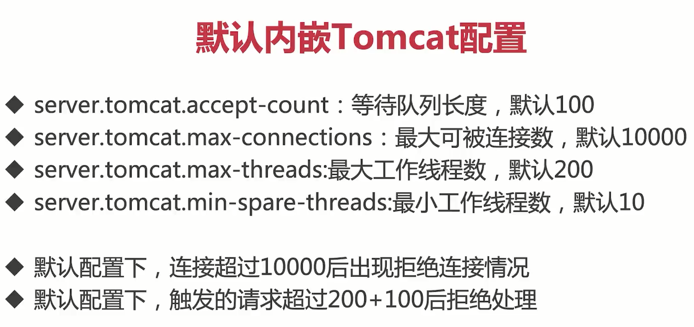

# 高并发秒杀项目

## 一、腾讯云服务端部署

1、在本地使用springboot maven打包插件打包本地项目

```java
 <build>
        <plugins>
            <plugin>
                <groupId>org.springframework.boot</groupId>
                <artifactId>spring-boot-maven-plugin</artifactId>
                <configuration>
                    <excludes>
                        <exclude>
                            <groupId>org.projectlombok</groupId>
                            <artifactId>lombok</artifactId>
                        </exclude>
                    </excludes>
                </configuration>
            </plugin>
        </plugins>
    </build>
```

2、在阿里云服务器上安装java、mysql

3、新建目录 `/var/www/miaosha/`，将项目打包后的jar文件`miaosha.jar`放到该目录中

4、编写springboot额外配置文件`application.properties`和部署脚本`deploy.sh`

```bash
#deploy.sh

#在后台运行springboot程序，可以在nohup.out文件中查看日志信息
nohup java -Xms400m -Xmx400m -XX:NewSize=200m -XX:MaxNewSize=200m -jar miaosha.jar --      spring.config.addition-location=/var/www/miaosha/application.properties
```

## 二、使用` Jmeter `进行接口测压


### 1、线程组


### 2、http请求


### 3、查看结果树


### 4、聚合报告


至此，Jmeter的基本使用就结束了

## 三、发现容量问题

## 1、server端并发线程数上不去

```bash
#查看java进程
ps -ef |grep java

#out
root     1268879 1268878  0 10:44 pts/0    00:00:38 java -Xms400m -Xmx400m -XX:NewSize=200m -XX:MaxNewSize=200m -jar miaosha.jar --spring.config.addition-location=/var/www/miaosha/application.properties

#查看springboot应用监听端口
netstat -anp | grep 1268879
#如下图
```


```bash
#查看当前进程包含多少个线程数
pstree -p 1268879|wc -l

#out
28
```

==也就是说当前内嵌的tomcat在没有外部压力的情况下维持了一个10个线程的线程池+18个其他Springboot中的线程 == 28个线程==

```bash
#使用top -H查看机器的性能信息
top -H
```


其中，

%Cpu（s）：1.0 us(user)用户态下对CPU的占有率 1.0 sy(system)系统态下对CPU的占有率

load average：cpu load的数量（2核CPU小于2即可），1分钟、5分钟、15分钟

#### 查看SpringBoot配置

spring-configuration-metadata.json文件中查看节点的配置




**在服务器上的application.properties文件中修改Tomcat配置为**

```properties
server.port=8081
server.tomcat.accept-count=1000
#4核8G的服务器中最大工作线程数量经验值为800 - 1000
server.tomcat.max-threads=800
#最小工作线程为100，给服务器足够的反应时间，避免一时间要创建大量线程
server.tomcat.min-spare-threads=100
```

#### **在设置Jmeter中设置http请求加上 keep-alive头部的情况为：**

- 当设置 Jmeter并发线程数为==100以下 <= 最小工作线程100==时，可以使用`pstree -p 1268879|wc -l` 看到当前进程中包含有==118==个线程正在运行（==100个Tomcat的最小工作线程和18个SpringBoot中的其他线程==）

- 当设置 Jmeter并发线程数为==100(最小) < 200 < 800(最大)===时，可以使用`pstree -p 1268879|wc -l` 看到当前进程中包含有==218==个线程正在运行（==200个Tomcat的工作线程和18个SpringBoot中的其他线程==）
- 当设置 Jmeter并发线程数为==1000 > 800(最大)===时，可以使用`pstree -p 1268879|wc -l` 看到当前进程中包含有==818==个线程正在运行（==800个Tomcat的最大工作线程数和18个SpringBoot中的其他线程==）

==Jmeter测压完毕后，这818个线程并不会立刻回到118个==，而是会==等待一定的超时时间==后，多于最小工作线程的线程才会被销毁

#### 在设置Jmeter中设置http请求取消 keep-alive头部的情况为：


==当Jmeter客户端发送请求完成后，Tomcat立即销毁多于最小工作线程的线程（达不到最大工作线程是因为先完成请求的线程已经被销毁了，所以最大只有511个线程）==


然后设置Jmeter并发线程为200，10秒内全部启动，每个线程发送10次请求时，主要压力发现在mysql数据库上


#### 配置内嵌Tomcat的参数


```java
//当Spring容器内没有TomcatEmbeddedServletContainerFactory这个bean时，会将该bean加载进Spring容器中
@Configuration
public class WebServerConfiguration implements WebServerFactoryCustomizer<ConfigurableWebServerFactory> {
    @Override
    public void customize(ConfigurableWebServerFactory factory) {
        //使用对应工厂类来定制Tomcat connector
        ((TomcatServletWebServerFactory) factory).addConnectorCustomizers(new TomcatConnectorCustomizer() {
            @Override
            public void customize(Connector connector) {
                Http11Nio2Protocol protocol = (Http11Nio2Protocol) connector.getProtocolHandler();
                protocol.setKeepAliveTimeout(30 * 1000);
                protocol.setMaxKeepAliveRequests(10000);
            }
        });

    }
}
```

### 响应时间变长导致TPS上不去


