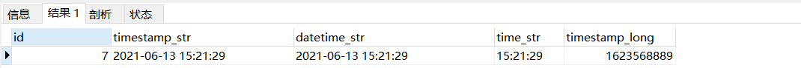
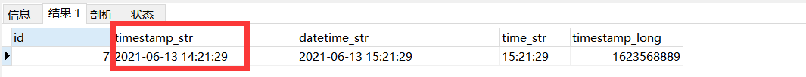
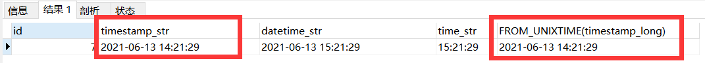

# Mysql基础

## 一、类型选择

### 1、char与varchar的选择

==长度固定或者长度较小==的字符串的存储选择`char`，因为对于`char`的处理速度要快于`varchar`

`char`不指定char(M)中的M默认使用==一个字符存储==

`varchar`必须指定varchar(M)中的M，且存储时每个值用==刚好够用的字符串长度加上用来存储字符串的长度==（即总长度为 L 字符+1/2 字字节）

### 2、建表时字段尽量非null

原因：

- 不好比较，对于空值必须使用` is null `或者 `is not null`进行比较
- 影响查询效率（索引的）

### 3、时间字段选择（datetime、timestamp、time、timestamp_long（长整型存储时间））

```sql
--第一次
INSERT INTO time_test(timestamp_str,datetime_str,time_str,timestamp_long) values (NOW(),NOW(),NOW(),UNIX_TIMESTAMP(NOW()));
select * from time_test;
--第二次
set time_zone='+7:00';
select * from time_test

--第三次
select id,timestamp_str,datetime_str,time_str,FROM_UNIXTIME(timestamp_long) from time_test
```

第一次插入时时区信息为："+8:00"



第二次插入时时区修改为:"+7:00"



可以看到当时区信息改变后，只有`timestamp`类型的数据随着时区改变了，其他的datetime、长整型、time都没有随时区改变。

长整型存储的时间使用`FROM_UNIXTIME(timestamp_long)`进行转换后，效果与`timestamp`效果一样



## 二、SQL

### 1、SQL语法规范

- mysql 对于 SQL 语句不区分大小写，SQL 语句关键字尽量大写 
- 值，除了数值型，字符串型和日期时间类型使用单引号 ( ‘ ’ )
- 表别名，列别名，都尽量使用双引号（“ ”）而且不建议省略 `as`
- 必须只能包含 A–Z, a–z, 0–9, _共 63 个字符
- 必须保证你的字段没有和保留字、数据库系统或常用方法冲突（==如desc，很可能就会设置为表的列名==）
- 在命令行中进行编写时==一个语句可以分开多行编写，以;或\g 结束==

### 2、基本sql语句

#### a）修改和创建表

```sql
-- 创建表
CREATE TABLE t_employee (
	`id` INT ( 11 ) PRIMARY KEY AUTO_INCREMENT COMMENT '员工id',
	`name` VARCHAR ( 32 ) NOT NULL DEFAULT '' COMMENT '员工姓名',
	`gender` CHAR ( 1 ) NOT NULL DEFAULT '男' COMMENT '性别',
	`birthday` DATETIME NOT NULL DEFAULT '1950-01-01' COMMENT '生日' 
) ENGINE = INNODB AUTO_INCREMENT = 1 DEFAULT CHARSET = utf8 COMMENT '员工表';

-- 删除表
DROP TABLE t_employee;

-- 重命名表
ALTER TABLE t_employee RENAME employee;

-- 添加列（默认在最后一列之后，可以使用after，before）
ALTER TABLE employee ADD COLUMN address VARCHAR ( 100 ) NOT NULL DEFAULT '' COMMENT '员工住址' AFTER gender;

-- 删除列
ALTER TABLE employee DROP COLUMN address;

-- 修改列
ALTER TABLE employee MODIFY COLUMN `name` VARCHAR(50);

-- 修改列名
ALTER TABLE employee CHANGE COLUMN `name` `e_name` VARCHAR(32);

-- 查看表结构
DESC employee;
```

#### b）表约束和索引

```sql
-- 查看某个表的约束信息
select * from information_schema.table_constraints where table_name='employee';

-- 查看表的索引信息 
show index from employee;
```


