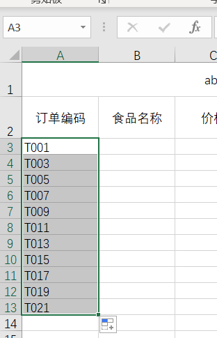
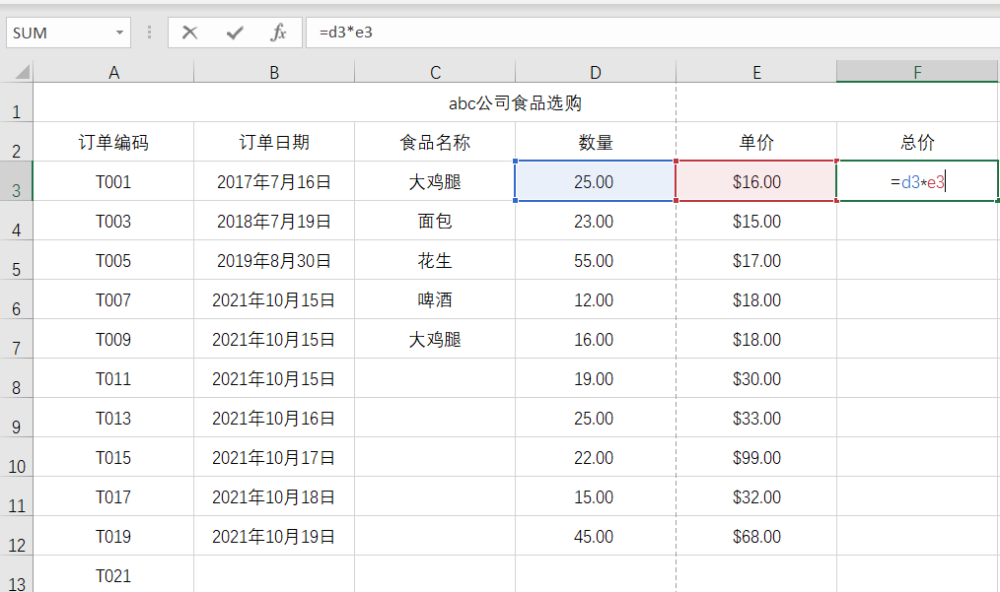

# Excel基础

## 1、excel中每个单元格是什么样的？

在Excel中每一个单元格都对应一个坐标，会在表格的左上角显示当前单元格的坐标，例如：

可以使用快捷键来快速移动单元格的位置：

|       快捷键       | 功能               |
| :----------------: | ------------------ |
|      tab 或 →      | 向右移动一个单元格 |
|  shift + tab 或 ←  | 向左移动一个单元格 |
|     enter 或 ↓     | 向下移动一个单元格 |
| shift + enter 或 ↑ | 向上移动一个单元格 |

## 2、如何设置每行或每列的宽度和高度？

可以通过鼠标拉伸单元格长度来完成。

> 小技巧：可以双击两个单元格间隔的拉伸标志来让单元格宽度适应内容宽度

## 3、如何将标题合并后居中？

让标题在合并单元格后的中间位置，可以先选中要合并的所有单元格，然后点击工具栏上的`合并后居中`即可，想要取消合并后居中就再次点击。

合并后居中效果图：

## 4、如何快速将多个列的单元格调整为同样的宽度？

首先可以选中要调整的每个列，注意是从最上面的列标识开始（ABCDFE...），然后使用鼠标调整任意一列的宽度，放开鼠标后，就可以达到各个列宽度一样的效果了。==（同样适合于每一行的高度噢）==

选中多列：

调整某一列宽度后释放鼠标：

## 5、如何快速输入编码？

例如，这里需要输入一个个的订单编号，而编号顺序是从T001-T015的，采用手动输入的方式会效率很低，可以使用快速填充序号的方式。

- 在第一行输入一个T001

- 将鼠标移到单元格的右下角，可以看到一个➕

- 按住这个➕往下滑动，放开鼠标后就可以生成一个序列啦

  

> 小技巧：也可以生成等差序列，可以先输入T001、T003，先选中这两个单元格，然后按住➕往下，就可以生成T005、T007等数字

## 6、Excel中日期显示

excel中的标准日期格式为：2017/6/23，可以用鼠标右键点击单元格后，选择`设置单元格格式`，就可以将日期调整为想要的格式输出，例如将2017/6/23显示为2017年6月23日

> 小技巧：1、可以使用 ctrl + : 来快速输入今天的日期
>
> 2、可以像填充编号一样，使用右下角的➕来自动递增填充日期，或者按年按月填满

## 7、如何快速在一个单元格中输入已经存在的信息？

比如目前在上方单元格中已经输入过一些内容了，现在需要在新的单元格中再次输入该内容

可以点击右键，选中`从下拉列表中挑选`，就可以选择一个已经填写过的内容了

## 8、如何根据单价和数量使用公式来求出总价？

excel中的乘法的公式内容是：`=v1*v2`，例如

然后点击enter，就可以得到计算结果；并且可以使用复制粘贴或者快速填充的➕，来对其他行进行求值

## 9、如何打印预览

这样就可以开启打印预览功能了

如果边框格式不符合自己的要求可以先绘制边框格式，然后再使用预览功能进行查看，最终打印。

## 10、如何冻结窗格？

为什么要冻结窗格？是因为我们在查看一个内容比较多的表格时，当查看后面的数据时就会不清楚数据的列名是什么了，这时候如果列名所在的行可以固定不动，不随鼠标滚动就好啦。

如何使用冻结窗格？

首先用鼠标选中要冻结的行的后面一行，然后点击工具栏中的`视图->冻结窗格`就可以啦

## 11、分割视窗

可以将一个表格分为两个完全一样的表格，然后就可以进行资料的比对

## 12、快速填充空值

可以先选中一些单元格，然后点击f5调出定位，然后选中空值后确认，填入需要填充的单元格（如 =a1），然后使用`ctrl + enter`

填充`总计`这一行剩下的空值

