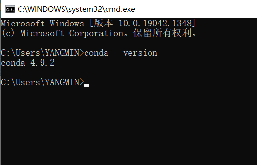

# win10 anaconda3安装

使用anaconda可以在选择虚拟环境时切换python的版本，但是anaconda会有一个默认的python版本，因此在下载anaconda时就事先选择了对应python版本默认是3.8的

anaconda清华镜像：[Index of /anaconda/archive/ | 清华大学开源软件镜像站 | Tsinghua Open Source Mirror](https://mirrors.tuna.tsinghua.edu.cn/anaconda/archive/)

python3.8对应的版本：[Anaconda3-2020.11-Windows-x86_64.exe](https://mirrors.tuna.tsinghua.edu.cn/anaconda/archive/Anaconda3-2020.11-Windows-x86_64.exe)

## 安装和配置anaconda3

1）安装时勾选 alluser，add to path

2）查看conda版本

3）切换清华源

windows10修改用户目录下的`.condarc`文件，将以下内容添加进去

```yaml
channels:
  - defaults
show_channel_urls: true
default_channels:
  - https://mirrors.tuna.tsinghua.edu.cn/anaconda/pkgs/main
  - https://mirrors.tuna.tsinghua.edu.cn/anaconda/pkgs/r
  - https://mirrors.tuna.tsinghua.edu.cn/anaconda/pkgs/msys2
custom_channels:
  conda-forge: https://mirrors.tuna.tsinghua.edu.cn/anaconda/cloud
  msys2: https://mirrors.tuna.tsinghua.edu.cn/anaconda/cloud
  bioconda: https://mirrors.tuna.tsinghua.edu.cn/anaconda/cloud
  menpo: https://mirrors.tuna.tsinghua.edu.cn/anaconda/cloud
  pytorch: https://mirrors.tuna.tsinghua.edu.cn/anaconda/cloud
  simpleitk: https://mirrors.tuna.tsinghua.edu.cn/anaconda/cloud
```

运行 `conda clean -i` 清除索引缓存

升级conda：conda update conda