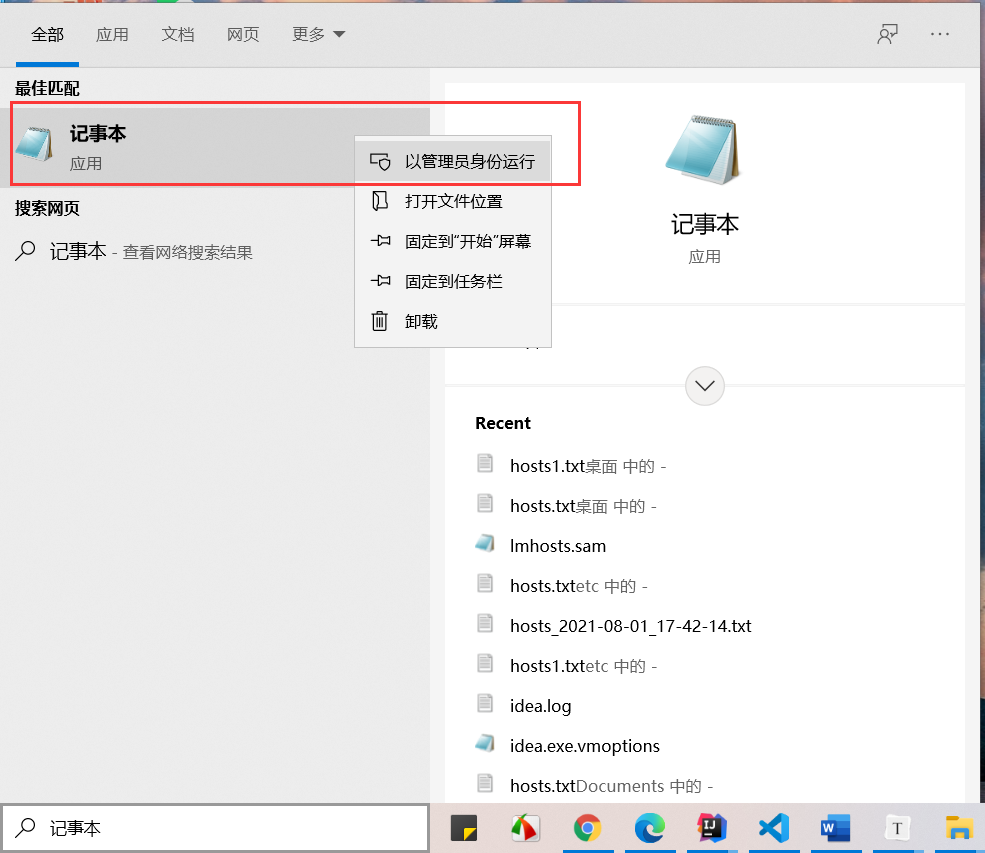

# win10修改hosts文件

win10系统中hosts文件在目录 `C:\Windows\System32\drivers\etc`下，默认是只有管理员可以修改的。

注意：win10中的hosts文件必须是“文件”类型，不可以是文本类型，它的编码格式也必须是“ANSI”。

1、第一种可以在搜索框中搜索“记事本”来使用管理员权限进行修改



2、第二种方式：在桌面上新建一个hosts文本文件，将域名信息写入后，另存为“所有文件”和编码为“ANSI”，此时可能还会是文本文件，需要进一步修改。

首先开启后缀名显示


此时，再次重命名文件时就可以看到.txt后缀了，修改文件为“所有文件”，然后将这个文件拷贝到 `C:\Windows\System32\drivers\etc`下。

在cmd中可以使用如下命令来检测是否修改成功。

```shell
#刷新dns缓存
ipconfig /flushdns
#显示所有dns缓存信息
ipconfig /displaydns
#测试联通
ping datanode1
```


