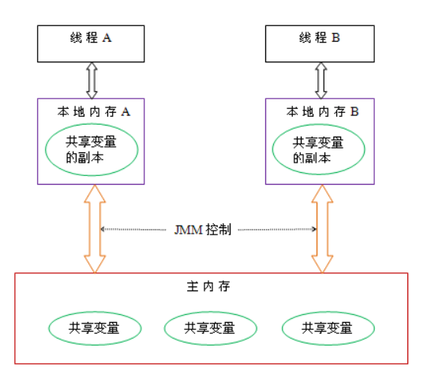

# 复习知识点（已复习标红）

# 一、java基础

1. ==八种基本类型和包装类型，缓存池==

2. ==String类底层，字符串常量池，intern方法jdk1.6，1.7区别==

3. ==String，StringBuilder，StringBuffer区别，拼接字符串时的优化（循环拼接和直接拼接不同）==

4. ==封装、继承、多态==

5. ==重写（两同两小一大）、重载==

6. ==Object类的所有方法，为什么重写equals时要重写hashcode==

7. ==final、static关键字==

8. ==反射底层原理、四种获取Class对象的方式==

   **注意：**反射是可以修改`final`变量的，但是如果是基本数据类型或者`String`类型的时候，无法通过对象获取修改后的值，因为`JVM`对其进行了内联优化。可以通过Field.get(Object)来获取`String`类型的值。

   反射的底层主要与类的加载机制有关。当使用反射获取Class类对象的时候，首先需要加载该类。加载-验证-准备-解析-初始化。

   在加载阶段，Java虚拟机使用类加载器将.class字节码文件加载到内存中，然后将二进制流中静态存储结构转化为方法区中运行时数据结构，最后在Java堆中创建一个Class类对象，作为访问方法区中数据结构的入口。

   验证阶段主要就是验证加载进来的字节码文件是否符合JVM规范、是否安全等

   准备阶段主要是为类的静态变量分配内存空间，并初始化默认值。如果被final修饰的静态变量则会直接初始化为用户指定的值

   解析阶段是虚拟机将常量池内的符号引用替换为直接引用的过程，也就是得到类或者字段、方法在内存中的指针或者偏移量

   初始化阶段会为类的静态变量初始化值，也会执行静态语句块。如果有父类，则会首先加载父类并初始化后，再初始化子类。

9. 注解底层原理

10. 泛型，泛型擦除，桥接方法实现泛型多态性

11. 异常

## 二、java集合


## 三、Java并发

1. ==原子性、可见性、有序性==

   原子性：一个操作要么都执行，要么都不执行，不可再分。Java内存模型只保证了基本读取和赋值是原子性操作，如果要实现更大范围操作的原子性，可以通过synchronized和Lock来实现。

   可见性：一个线程对共享变量的修改在何时对另一个线程可见，这是由Java内存模型控制的。每个线程有自己的本地内存（抽象概念：主要包括缓存、写缓存区、寄存器），而共享变量在主存中，本地内存里有共享变量的副本，Java内存模型决定了何时将本地内存里的数据刷新到主存中去。

   有序性：为了提升程序执行的性能，编译器和处理器会对指令进行重排序。在多线程的情况下就会产生一些问题，例如单例模式的时候，其他线程可能会使用到未初始化的对象，从而产生错误。JMM使用happen-before规则来保证程序执行的有序性。

   8条规则，4条主要的。

   程序顺序规则：一个线程中的每个操作，happens- before 于该线程中的任意后续操作。

   监视器锁规则：对一个监视器锁的解锁，happens- before 于随后对这个监视器锁的加锁。

   volatile 变量规则：对一个 volatile 域的写，happens- before 于任意后续对这个 volatile 域的读。

   传递性：如果 A happens- before B，且 B happens- before C，那么 A happens- before C。

2. ==java内存模型==

   

   Java 线程之间的通信由 Java 内存模型控制，JMM 决定一个线程对共享变量的写入何时对另一个线程可见。从抽象的角度来看，JMM 定义了线程和主内存之间的抽象关系：线程之间的共享变量存储在主内存（main memory）中，每个线程都有一个私有的本地内存（local memory），本地内存中存储了该线程以读 / 写共享变量的副本。本地内存是 JMM 的一个抽象概念，并不真实存在。它涵盖了缓存，写缓冲区，寄存器等。

3. ==如何实现线程安全？==

   线程互斥（synchronized，lock）

   非阻塞同步（CAS）

   无同步方案（不存在共享变量）：线程私有的栈局部变量，ThreadLocal

4. 线程状态及转换

   

5. synchronized和ReentrantLock区别

6. Object的wait()、notify()与Lock的await()、signal()的区别，各自的用法

7. synchronized锁升级过程

   

8. synchronized思维导图

   

9. synchronized jdk1.6优化（自旋锁，自适应自旋锁，锁粗化，锁消除，锁升级过程）

10. volatile作用，底层原理，可见性和有序性怎么实现的

    可见性实现：

    对volatile修饰的变量进行写操作时，会添加一个lock前缀的指令。lock前缀指令的作用是

    对于多核CPU：

    ```java
    1. 将当前处理器缓存行的数据写回到系统内存。
    2. 这个写回内存的操作会使在其他CPU里缓存了该内存地址的数据无效。
    ```

    对应JMM就是：

    ```java
    1. lock前缀的指令让线程工作内存中的值写回主内存中；
    2. 通过缓存一致性协议，其他线程如果工作内存中存了该共享变量的值，就会失效；
    3. 其他线程会重新从主内存中获取最新的值；
    ```

    有序性实现：

    happen-before规则和禁止指令重排（内存屏障）。在对volatile变量进行写操作时，会在前后分别插入一个StoreStore屏障和StoreLoad屏障。在对volatile变量进行读操作时，会在后面添加两个屏障，分别是LoadLoad和LoadStore屏障。

    happen-before规则：对volatile变量的写操作先行发生于对其的读操作。

    volatile适合与get-set操作，而不适合于get-operation操作。不具有原子性。

11. 啊啊

## 四、JVM


## 五、Java IO


## 六、Mysql


## 七、Redis


## 八、Spring、SpringMVC、SpringBoot


## 九、计算机网络


## 十、操作系统


## 十一、RocketMQ


## 十二、Spark


4道编程3个小时