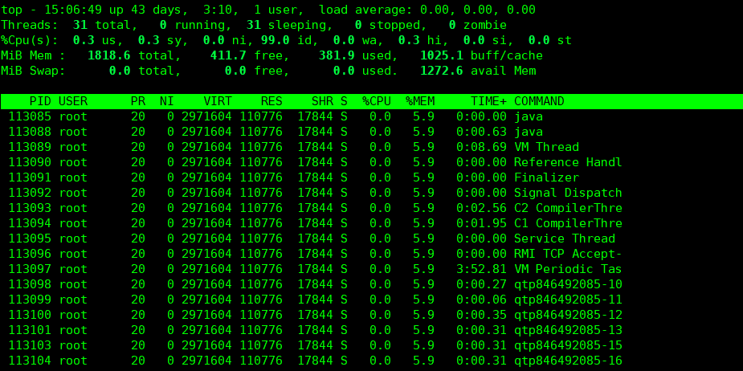
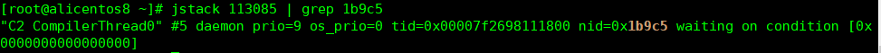
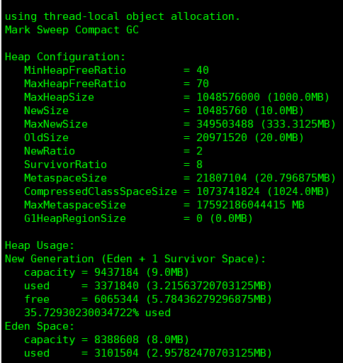

# 网易正式批

## 一面：

- 自我介绍
- 大数据项目介绍
- java反射、哪里用到了反射
- 类加载过程
- JUC、AQS、CountDownLatch和CycleBarrier区别，用法
- 数据库事务特性、隔离性怎么保证的
- 数据库索引、字段的区分度存在什么地方
- undolog里面存的什么、可以删除吗、什么时候删除
- java为什么需要多线程、解决了什么问题。从BIO模型扯到线程池，从线程池扯到一般线程池和Tomcat线程池的区别

## 总监面：


==主要准备的方面：项目，架构设计，场景题，大数据处理题，基础知识过一遍==

==主要就是什么框架可以做什么事，可以解决什么问题！这个一定要弄明白，就是怎么去用==

## 第一重要：项目面试思路

先按简历上单机项目的情况去说，如果面试官问到数据量大了用户增多了怎么办？

再讲自己会如何对项目进行重构成分布式的，以及分布式中常见的问题自己会如何解决。每一个组件承担什么样的功能都要弄得很清楚，如何提高系统的可用性。分布式理论CAP和BASE通俗理解，分布式事务，消息队列。

## 第二重要：大数据项目遇到的三个问题，如何解决的？

广播变量，Cache方法（Spark有多少种缓存方式），CheckPoint（作用，具体输出到哪个目录去了）

大数据集群的配置情况，每台机器资源的分配情况

Spark运行流程是怎么样的，与Hadoop的区别在哪里

Hadoop的MapReduce过程是怎么样的

## 第三重要：常见大数据处理题和智力题

大数据处理题和智力题

## 第四重要：java和中间件的基础知识

java基础、并发、集合、jvm、spring、设计模式、mysql、redis

## 第五重要：常见算法和自己写过的算法

过一遍思路，到时候即使忘记怎么写了也可以讲讲自己的思路是怎么样的


# 网易云总监面     

  其实已经发了意向书，但是今天收到hr加面的电话，说影响评级，没怎么准备就上了。 

  下面是一些问题 

  1.自己做的[项目]()，用到了哪些技术 

  2.实习期间做的一些事情，有没有遇到困难怎么解决的 

  3.实习期间做的有成就感的一件事 

  4.mock测试，抓包工具原理 

  5.数据埋点，上报的id如何设置 

  6.[网易]()云与[机器学习]()相关的场景，边缘计算等 

  7.Https和Http，SSL握手详情，对称与非对称加密的区别和应用 

  8.TCP三次握手四次挥手 

  9.数据库索引，原理，B+树 

  10.多线程，临界区，锁的原理，重入锁与互斥锁 

  11.路由原理（其他的记不清了） 

  总结：总监很好交流，没有架子也不会有压迫感，应该是比较好的一次面试体验


第三面（总监面 一小时+） 

   1.自我介绍（3分钟）  

   2.介绍ETL开发[项目]()（15分钟）  

   3.手撕代码：知道[二叉树]()前中序遍历，怎么得到后续遍历，限时5分钟。  

   \4.  业务题  

   1）开发统计某app用户各功能使用时长，整个流程怎么实现，怎么优化，怎么横向拓展。  

   2）统计评估各个网页的重要性，采取的[算法]()思路，spark代码实现。（实际就是Google page rank[算法]()）  

   5，未来规划，优缺点，offer情况，能否实习  

   6.提问


- 看了你的面经，我只问了两三个项目问题，后面都是聊天和部门介绍😂

- 还行。和你的一样，都是项目上的问题。不过技术问的不多，就问了设计模式。一直在问项目管理方面的东西
- 上来问我有什么可以打动他的项目。。然后问的都是技术上面的，差不多，基本都是实际项目中的问题


## 一、四道笔试题


## 二、比较重要的面试问题

### 1、在ArrayList中插入100W条数据的时间复杂度是多少？

```markdown
分两种情况
1、先扩容，使用ensureCapacity方法进行扩容，然后再插入，平均时间复杂度为 O(1)
2、直接一个个插入，每次到达阈值时都需要进行扩容成原来的1.5倍，平均时间复杂度为O(n)，可以使用等比数列求和的方式求得
```

### 2、Spring如何解决循环依赖的？

```markdown
循环依赖一般有三种：
1、构造器注入导致循环依赖：无法解决，会抛出异常。
2、非单例对象之间的循环依赖：无法解决，会导致无限创建对象，报OOM
3、单例对象的setter方式注入导致循环引用：三级缓存来解决
在Spring中初始化一个单例对象主要分为三步：
1、通过构造方法实例化这个对象createBeanInstance
2、属性填充（注入）populateBean
3、初始化Bean，调用Spring xml中配置的init-method方法
解决循环依赖，主要是在第二步，属性填充的时候解决的。
常见场景：在服务A中注入服务B，然后在服务B中注入A，都使用 @autowired方式注入并使用 @Service注解放入到容器中，因为Bean默认是单例的，这时候会出现单例模式的setter注入循环依赖。
使用三级缓存来解决这个问题，三级缓存分别是：
一级缓存：<beanName，instance>，用来存储初始化完成的单例对象 -> singletonObjects
二级缓存：<beanName，instance>，用来存储实例化完成，但是还未初始化的单例对象 -> earlySingletonObjects
三级缓存：<beanName，ObjectFactory>，用来存储实例化单例对象的对象工厂 -> singletonFactories
流程：
1、首先服务A使用构造函数完成实例化，然后将用于构建自己的对象工厂提前暴露在三级缓存中；
2、A进行属性填充操作，这时候会发现自己依赖B，就会尝试去一级、二级、三级缓存中去找B，都没有B，此时说明B还没有被创建，于是会先走创建B的流程
3、B在实例化后也会把用于构建自己的对象工厂提前暴露在三级缓存中，然后进行属性填充时发现自己依赖A，这时候就会尝试去一级、二级、三级缓存中去找A，发现只有三级缓存中有A的对象工厂，就会使用A的对象工厂的getObject对象来拿到A未初始化的对象，然后将A从三级缓存移到二级缓存中。
4、B这时候就拥有了A的引用，就可以进行后面的初始化流程，然后等到自己初始化完成后，将自己放入到一级缓存中并从其他缓存中移出。
5、此时返回A的属性填充流程，在一级缓存中就可以拿到B，完成自己后续的初始化工作，这样就解决了单例对象之间使用setter方式注入的循环依赖问题。
```

### 3、JVM调优问题

#### 3.1、如何找到某个进程中最占CPU的线程？（CPU列）占用CPU时间最长的线程？（TIME列）

使用命令 `top -Hp pid`查找到最占CPU的线程



==jstack用于查看某个进程内线程的堆栈信息。==

在上一步中，可以看到最占用CPU时间的线程id为113097

使用命令将其转化为十六进制 `printf "%x\n" 113097` 得到 `1b9c9`

然后使用 `jstack 113085 | grep 1b9c9`，其中113085是进程id，就可以输出是哪个线程的哪个方法最占用CPU时间了



### 3.2、如何查看JVM堆内存使用情况

使用命令 `jmap -heap pid`



### 4、

## BIM模型文件分片：

首先，前端在上传大文件的时候会对大文件进行切分，将大文件切分为多个大小相同的文件块，每个块都有一个文件的块号。然后使用spark-md5这个前端包对这些块进行递归的md5求值，作为当前上传文件的文件标识。然后前端开始上传这个大文件到后端去。

在上传这个大文件之前，首先要就要发送一个请求到后端，查询redis中是否有这个文件标识的key，如果有的话，这说明这个文件正在上传过程中，就是开始上传了，但是还没有上传完毕。这时候就要获取redis中已经上传了分块的所有块号集合，然后返回给前端，前端就对这个已经上传的块号做一个差集，就只将那些还没有上传的块进行上传。之所以不把已经上传的所有块的块号记录在前端的localstorage中，是因为存储在前端的话，如果用户换了一个浏览器，那么就取不到这个已经上传的块号了。

每次当一个分块上传到后端完成后，都会判断当前redis中的分块是否已经全部上传完毕，如果已经全部上传完毕的话，那么就会首先在数据库中记录下这个文件的信息，包括文件标识，文件路径等等，然后会删除掉redis中对应的文件标识的key。前端在第一次上传时，在redis没有找到这个文件标识的key，还会去数据库中查找是否有这个文件标识对应的记录，如果有这说明已经上传过了，就可以直接返回这个文件已经上传过了，达到一个文件秒传的目的。这样就可以做到一个文件分块上传、断点续传和秒传的功能了。

但是这样还会有一个问题，就是如果有人恶意攻击，他每次都上传不完整的文件到服务器，因为这个文件没有上传完，他原来上传的分片已经写入到服务器上指定文件中，服务器中就会产生一些垃圾文件，让硬盘被占满。所以，断点续传这个功能虽然应该让用户可以在上传失败后，过一段时候仍然可以继续接着原来的地方上传，但是必须要有一个期限设置。当到达这个期限的时候，就会检查redis中是否还有这个文件标识对应的key，如果有的话，这说明用户没有在有效时间区间内将文件上传完毕。就应该要对redis中的这个key和这个文件标识所对应的服务器上存储位置上的文件进行清理。这个功能的话，是使用了一个定时任务的方式，在前端上传第一个文件分片的时候，不仅会在redis记录这个文件标识所对应的服务器上的存储路径和已上传的分块序号集合，而且会开启一个定时任务，我这边设定的是6个小时，就是用户在6个小时内，没有将文件上传完毕的话。在程序中的体现就是，这个定时任务会去检查redis中是否有这个文件标识，如果有这个文件标识，那么说明这个文件还没有上传完毕，已经失效，然后还要去判断数据库中是否有这个文件标识的记录，如果也没有，那么就要对redis中的记录和存储的文件进行清理。这样就防止了别人利用这个设计来进行攻击了。

然后这样就完成了一个大文件上传的功能。另外，为了可以在浏览器上对这个BIM模型进行预览，还会使用到autodesk的一个插件叫autodesk forge，利用这个插件开放的接口可以把这个BIM模型进行转化，转换为一个svf清单文件，这个是一个文件夹。里面包含了很多个小文件和子文件夹。然后使用一个forge组件的js就可以加载这个转换后的文件在浏览器上进行展示。但是由于autodesk服务器是在国外，所以在向autodesk服务器上加载这个文件的时候，就会比较卡顿。所以当时我就将这些转换后的svf清单文件都下载到公司本地服务器上来，这样来提升一个网页的加载速度。由于他是有很多的一个小文件，所以我采用了一个多线程的方式来对这些小文件进行下载，使用了countdownlatch来进行计数，创建了一个线程池来执行这些任务，没执行完一个任务就将countdownlatch使用down方法进行减一，主线程上使用wait方法来等待所有的任务执行完后继续后续流程。