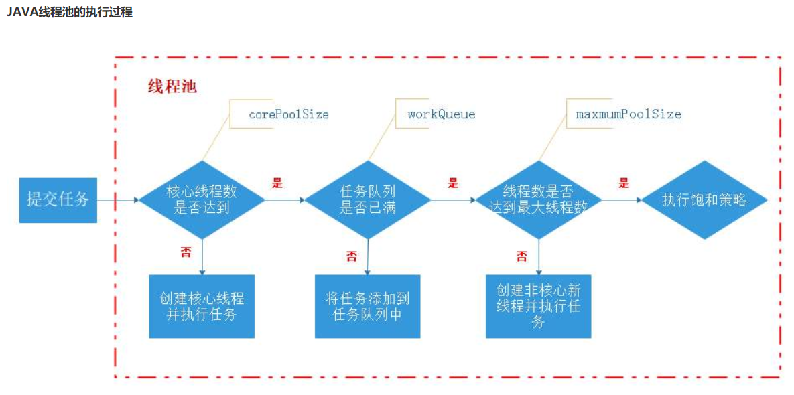

# Spring相关

## 一、Spring


## 二、SpringMVC


## 三、SpringBoot


## 四、Tomcat

Tomcat线程池参数设置主要包含四个参数：

```java
//最大工作线程数，默认200。
server.tomcat.max-threads=200
//最大连接数默认是10000
server.tomcat.max-connections=10000
//等待队列长度，默认100。
server.tomcat.accept-count=100
//最小工作空闲线程数，默认10。
server.tomcat.min-spare-threads=10
```

对于一般的线程池，当一个任务进来时，会按照下图的逻辑进行线程的创建



但对于Tomcat，在核心线程数满后，如果还有任务过来，会继续创建线程来处理任务，直到线程数达到最大线程数。当达到最大线程数之后，才会进入到阻塞队列中去。

而且对于Tomcat有两种IO模型，一种是BIO模式，一种是NIO模式。

对于BIO模式，对于每一个连接，都需要有一个线程来处理请求，所以最大连接数max-connections默认是等于最大线程数max-threads

而对于NIO模式，一个线程可以管理多个连接，所以最大连接数可以大于最大线程数的

对于N核CPU的机器

对CPU密集型任务，最大线程数一般设置为 (N+1)

对IO密集型任务，最大线程数一般设置为 (2*N) 或者(N / 阻塞系数)，阻塞系数一般是0.8 - 0.9

## 五、Mybatis

