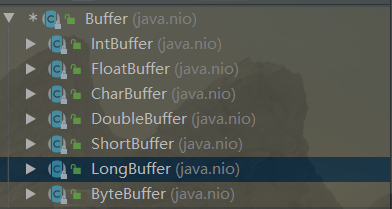

# Java

## 一、java基础

### 1、八种基本类型和包装类型，缓存池

八种基本类型分别是：byte（1个字节）、boolean（1位）、char（2个字节）、short（2个字节）、int（4个字节）、long（8个字节）、float（4个字节）、double（8个字节）

基本类型自动转化为包装类型是自动装箱，包装类型自动转化为基本类型是自动拆箱

例如，int/Integer 类型的变量，自动装箱时使用的是 `Integer.valueOf(int x)`方法，自动拆箱时会使用Integer对象的`intValue()`方法

在包装类型中有一些会有缓存池，就是用来缓存一些包装类型对象的。Integer、Byte、Short缓存的值的范围是 `-128 ~ 127`，Boolean缓存了True和False，Character缓存了  `\u0000 ~ \u007F`。

### 2、String类底层，字符串常量池，intern方法jdk1.6，1.7区别

String类被final修饰，所以不可以继承；它包含一个被final修饰的字符数组，后面改为了字节数组，并且在String类内部没有修改数组的方法，所以String对象是不可变的。

```java
public final class String
    implements java.io.Serializable, Comparable<String>, CharSequence {
    /** The value is used for character storage. */
    private final char value[];
```

- 直接使用双引号声明出来的`String`对象会直接存储在常量池中。
- 如果不是用双引号声明的`String`对象，可以使用`String`提供的`intern`方法。intern 方法会从字符串常量池中查询当前字符串是否存在，若不存在就会将当前字符串放入常量池中

字符串常量池在JDK1.6之前是位于方法区的，在JDK1.7以后移到了堆中。字符串常量池底层是一个`StringTable`，它是一个不可以扩容的HashTable，默认大小是1009，可以指定虚拟机参数来修改这个值。这个HashTable的key是字节数组的hash值，value是String对象的引用。

```java
	String s = new String("1");
    s.intern();
    String s2 = "1";
    System.out.println(s == s2);

    String s3 = new String("1") + new String("1");
    s3.intern();
    String s4 = "11";
    System.out.println(s3 == s4);
    // 1.6 false false
	// 1.7 false true
```

### 3、String，StringBuilder，StringBuffer区别，拼接字符串时的优化（循环拼接和直接

### 拼接不同）

使用 + 来连接字符串时，编译器会优化为使用StringBuilder来进行连接。但是在循环内使用 + 进行连接字符串时，每次循环都会创建一个StringBuilder的对象，可能会导致对象创建过多的情况。

String类由于是不可继承的，其中的字节数组也是不可修改的，所以String类对象是不可变的，每次修改字符串需要新建对象，是线程安全的。

StringBuilder和StringBuffer都是继承于AbstractStringBuilder，其中用来存储数据的字符数组是可变的，而且还具有一些可以操作字符数组的方法，所以它们可以在不新建对象的情况下修改字符串。它们的默认字符数组大小为16，StringBuffer用于操作字符串的方法基本都使用synchronized修饰，所以是线程安全的。

单线程情况下，操作少量字符串使用String即可；操作大量字符串，尤其是在循环中操作字符串，使用StringBuilder；多线程情况下操作大量字符串使用StringBuffer。

### 4、封装、继承、多态

封装：主要是为了将一个类的内部细节给隐藏起来，只提供一些可以向外调用的接口，以此保证类内部的安全性。例如String类的内部有一个私有的字节数组用来存放字符串，String类被设计为不可以修改的。如果把字节数组修改为公有的，那么用户就可能直接修改字节数组，但是对应的字节数组还有一个length属性，就不会被同步修改，导致不一致的情况。

继承：Java只支持类之间的单继承关系，但是它支持接口之间的多继承。继承主要是为了实现代码的复用，可以将多个类的公用代码抽离出来，避免冗余的代码。并且可以为后续的多态提供必要的条件。

多态：多态分为运行时多态和编译时多态。编译时多态代表的是一个类中的方法重载，运行时多态代表的是子类对父类方法的重写。运行时多态产生的必要条件是：子类继承父类，子类重写父类方法，调用接口时方法参数使用父类的引用。这样在实际调用方法时就会判断当前是哪个子类的对象，从而调用子类中自己的实现。

### 5、重写（两同两小一大）、重载

### 6、Object类的所有方法，为什么重写equals时要重写hashcode

### 7、final、static关键字

### 8、反射底层原理、四种获取Class对象的方式

注意：反射是可以修改final变量的，但是如果是基本数据类型或者String类型的时候，无法通过对象获取修改后的值，因为JVM对其进行了内联优化。可以通过Field.get(Object)来获取String类型的值。

反射的底层主要与类的加载机制有关。当使用反射获取Class类对象的时候，首先需要加载该类。加载-验证-准备-解析-初始化。

在加载阶段，Java虚拟机使用类加载器将.class字节码文件加载到内存中，然后将二进制流中静态存储结构转化为方法区中运行时数据结构，最后在Java堆中创建一个Class类对象，作为访问方法区中数据结构的入口。

验证阶段主要就是验证加载进来的字节码文件是否符合JVM规范、是否安全等

准备阶段主要是为类的静态变量分配内存空间，并初始化默认值。如果被final修饰的静态变量则会直接初始化为用户指定的值

解析阶段是虚拟机将常量池内的符号引用替换为直接引用的过程，也就是得到类或者字段、方法在内存中的指针或者偏移量

初始化阶段会为类的静态变量初始化值，也会执行静态语句块。如果有父类，则会首先加载父类并初始化后，再初始化子类。

例如，通过反射获取类的构造器时：

- 先尝试从缓存中获取；

- 如果缓存没有，则从jvm中重新获取，并存入缓存，缓存使用软引用进行保存，保证内存可用；

有一个ReflectionData用来缓存从JVM中获取的类的构造器，使用软引用进行保存。

```java
// reflection data that might get invalidated when JVM TI RedefineClasses() is called
    private static class ReflectionData<T> {
        volatile Field[] declaredFields;
        volatile Field[] publicFields;
        volatile Method[] declaredMethods;
        volatile Method[] publicMethods;
        volatile Constructor<T>[] declaredConstructors;
        volatile Constructor<T>[] publicConstructors;
        // Intermediate results for getFields and getMethods
        volatile Field[] declaredPublicFields;
        volatile Method[] declaredPublicMethods;
        volatile Class<?>[] interfaces;

        // Value of classRedefinedCount when we created this ReflectionData instance
        final int redefinedCount;

        ReflectionData(int redefinedCount) {
            this.redefinedCount = redefinedCount;
        }
    }
```

### 9、注解底层原理

不能使用关键字extends来继承某个@interface，但注解在编译后，编译器会自动继承java.lang.annotation.Annotation接口.

虽然反编译后发现注解继承了Annotation接口，即使Java的接口可以实现多继承，但定义注解时依然无法使用extends关键字继承@interface。

### 10、泛型，泛型擦除，桥接方法实现泛型多态性

从编译的结果来看，我们本意重写setValue和getValue方法的子类，竟然有4个方法，其实不用惊奇，最后的两个方法，就是编译器自己生成的桥方法。可以看到桥方法的参数类型都是Object，也就是说，子类中真正覆盖父类两个方法的就是这两个我们看不到的桥方法。而打在我们自己定义的setvalue和getValue方法上面的@Oveerride只不过是假象。==而桥方法的内部实现，就只是去调用我们自己重写的那两个方法==。

所以，虚拟机巧妙的使用了桥方法，来解决了类型擦除和多态的冲突。

### 11、异常


## 二、java并发

1. ==原子性、可见性、有序性==

   原子性：一个操作要么都执行，要么都不执行，不可再分。Java内存模型只保证了基本读取和赋值是原子性操作，如果要实现更大范围操作的原子性，可以通过synchronized和Lock来实现。

   可见性：一个线程对共享变量的修改在何时对另一个线程可见，这是由Java内存模型控制的。每个线程有自己的本地内存（抽象概念：主要包括缓存、写缓存区、寄存器），而共享变量在主存中，本地内存里有共享变量的副本，Java内存模型决定了何时将本地内存里的数据刷新到主存中去。

   有序性：为了提升程序执行的性能，编译器和处理器会对指令进行重排序。在多线程的情况下就会产生一些问题，例如单例模式的时候，其他线程可能会使用到未初始化的对象，从而产生错误。JMM使用happen-before规则来保证程序执行的有序性。

   8条规则，4条主要的。

   程序顺序规则：一个线程中的每个操作，happens- before 于该线程中的任意后续操作。

   监视器锁规则：对一个监视器锁的解锁，happens- before 于随后对这个监视器锁的加锁。

   volatile 变量规则：对一个 volatile 域的写，happens- before 于任意后续对这个 volatile 域的读。

   传递性：如果 A happens- before B，且 B happens- before C，那么 A happens- before C。

2. ==java内存模型==

   

   Java 线程之间的通信由 Java 内存模型控制，JMM 决定一个线程对共享变量的写入何时对另一个线程可见。从抽象的角度来看，JMM 定义了线程和主内存之间的抽象关系：线程之间的共享变量存储在主内存（main memory）中，每个线程都有一个私有的本地内存（local memory），本地内存中存储了该线程以读 / 写共享变量的副本。本地内存是 JMM 的一个抽象概念，并不真实存在。它涵盖了缓存，写缓冲区，寄存器等。

3. ==如何实现线程安全？==

   线程互斥（synchronized，lock）

   非阻塞同步（CAS）

   无同步方案（不存在共享变量）：线程私有的栈局部变量，ThreadLocal

4. 线程状态及转换

   

5. synchronized和ReentrantLock区别

6. Object的wait()、notify()与Lock的await()、signal()的区别，各自的用法

7. synchronized锁升级过程

   

8. synchronized思维导图

   

9. synchronized jdk1.6优化（自旋锁，自适应自旋锁，锁粗化，锁消除，锁升级过程）

10. volatile作用，底层原理，可见性和有序性怎么实现的

    可见性实现：

    对volatile修饰的变量进行写操作时，会添加一个lock前缀的指令。lock前缀指令的作用是

    对于多核CPU：

    ```java
    1. 将当前处理器缓存行的数据写回到系统内存。
    2. 这个写回内存的操作会使在其他CPU里缓存了该内存地址的数据无效。
    ```

    对应JMM就是：

    ```java
    1. lock前缀的指令让线程工作内存中的值写回主内存中；
    2. 通过缓存一致性协议，其他线程如果工作内存中存了该共享变量的值，就会失效；
    3. 其他线程会重新从主内存中获取最新的值；
    ```

    有序性实现：

    happen-before规则和禁止指令重排（内存屏障）。在对volatile变量进行写操作时，会在前后分别插入一个StoreStore屏障和StoreLoad屏障。在对volatile变量进行读操作时，会在后面添加两个屏障，分别是LoadLoad和LoadStore屏障。

    happen-before规则：对volatile变量的写操作先行发生于对其的读操作。

    volatile适合与get-set操作，而不适合于get-operation操作。不具有原子性。

11. 

## 三、JVM

1、CMS、G1垃圾回收器


## 四、JAVA NIO

### 1、Buffer缓冲区

Java BIO是面向字节流的，而Java NIO是面向缓冲区的。而缓冲区就对应于Java NIO中的Buffer类及其子类，继承图如下：



Buffer中有三个属性，分别是

- position
- limit 
- capacity

==写模式下：==

position指向的是当前可以写入的位置，区间为`[0, capacity]`，初始时position为0，表示在0号位置开始写入，所以==并不是代表已经写入的数据的最后一个位置的==

limit在写模式下就等于capacity的值，代表可以有多少个数据可以读

capacity就是当前缓冲区的容量

举例：

```java
// 新建一个IntBuffer，分配容量为8，初始时position = 0，limit = 8，capacity = 8
IntBuffer buffer = IntBuffer.allocate(8);

// 往缓冲区内放入3个整形数字，此时，position = 3, limit = 8，capacity = 8
int[] a = new int[]{1,2,3};
buffer.put(a);

// 再放入5个数字，此时，position = 8, limit = 8，capacity = 8
buffer.put(new int[]{4,5,6,7,8});

// 再继续尝试放1个数字，会报缓冲区溢出异常；java.nio.BufferOverflowException
buffer.put(9);
```

==读模式下：==

使用 `buffer.flip()`切换到读模式，初始时`limit = position，position = 0，mark = -1`； 

position初始时为0，读取1个数字后为1，指向的是下一个要读取的数字的位置。

limit此时是缓冲区中有的数据个数，等于之前写入数据后的position位置。

capacity此时依旧是缓冲区容量

```java
IntBuffer buffer = IntBuffer.allocate(8);
// 写入6个数据
int[] a = new int[]{1,2,3,4,5,6};
buffer.put(a);
System.out.println(buffer.position());

// 读数据
buffer.flip();
// 读取1个数据
int t = buffer.get();
System.out.println(t); // 1
System.out.println(buffer.position()); // 1
// 读取5个数据
int[] b = new int[5];
buffer.get(b);
System.out.println(buffer.position());  //6
// 当读取的数据大于缓冲区已有的数据个数，也就是position > limit时，会产生异常java.nio.BufferUnderflowException
int i = buffer.get();
System.out.println(i);
```


### 2、DMA是什么？有什么用？

DMA（Direct Memory Access，直接内存访问）：是一种不需要依赖CPU，使用DMA硬件直接与系统总线连接来读写外设上的数据的方式。

CPU与外设是在系统总线上进行数据交互的，在没有DMA之前，CPU与外设要进行数据交互，一般有两种方式：①程序传送方式 ②中断传送方式

程序传送方式：CPU对外设进行轮询，如果外设此时的状态可以读取或者写入数据了，CPU就会与外设之间进行数据传输。（CPU轮询外设状态，效率较低且浪费CPU资源）

中断传送方式：外设主动向CPU发送可以读取或写入数据的请求，等待CPU来处理。在外设没有向CPU发送请求的时候，CPU和外设独立做自己的事。这种方式需要CPU进行断点和现场保护，浪费了很多CPU时间，只适合传送少量的数据。

DMA主要就是为了解决批量数据的输入和输出问题的，外设上的数据不需要通过CPU就可以和存储器进行交互，读取和写入速度只取决于存储器和外设的工作速度。

工作流程：

**①I/O设备向DMA控制器发送DMA请求，再由DMA控制器向CPU发送总线请求(统称为DMA请求**，用以传输数据。

②DMA的数据传输可以以单字节(或字)为基本单位，对于以数据块为单位的传送(如银盘)，DMA占用总线后的数据输入和输出操作都是通过循环来实现。

③DMA控制器向CPU发送中断请求，CPU执行中断服务程序做DMA结束处理

### 2、零拷贝是什么？Java NIO中怎么实现的？

==服务器一次普通的请求接受与响应过程：==

1、用户使用`read()`来读取客户端传过来的数据，首先系统需要从用户态切换为内核态，然后将网卡缓冲区里的数据使用DMA的方式读取到内核缓冲区，此时不需要CPU参与数据读取。

2、系统从内核态切换到用户态，使用CPU将内核缓冲区里的数据读取到用户缓冲区，对数据进行一些业务处理。

3、使用 `write()`向客户端返回响应的数据，首先系统要从用户态切换到内核态，使用CPU将用户缓冲区里的数据写入到网络缓冲区。

4、然后使用DMA的方式将网络缓冲区里的数据写入到网卡缓冲区中，通过网络发送给客户端，最后系统再由内核态切换回用户态。

一共涉及==4次==用户态与内核态的切换和==2次==CPU参与数据读写，是十分消耗资源的。

==基本的零拷贝实现：`mmap()`方式==

```c
tmp_buf = mmap(file, len);
write(socket, tmp_buf, len);
```

mmap主要是使用系统调用的方式，将内核缓冲区的地址空间和用户缓冲区的地址空间做了一个映射，可以让系统在用户态直接读取并操作内核缓冲区里的数据。


## 五、额外知识

在linux系统中可以使用命令 `strace -ff -o out java SocketNIO` 来查看在SocketNIO这个java程序中发生的系统调用，每个线程都会以out.xxxxx的日志形式打印出来。

在 `/proc/(pid)/` 目录下有这个进程id号对应的信息，其中 fd文件夹中存储了所有打开的文件描述符（包含socket文件描述符），task目录里有每个进程和线程的id构成的目录，其中的目录结构和父pid的目录结构是一样的。