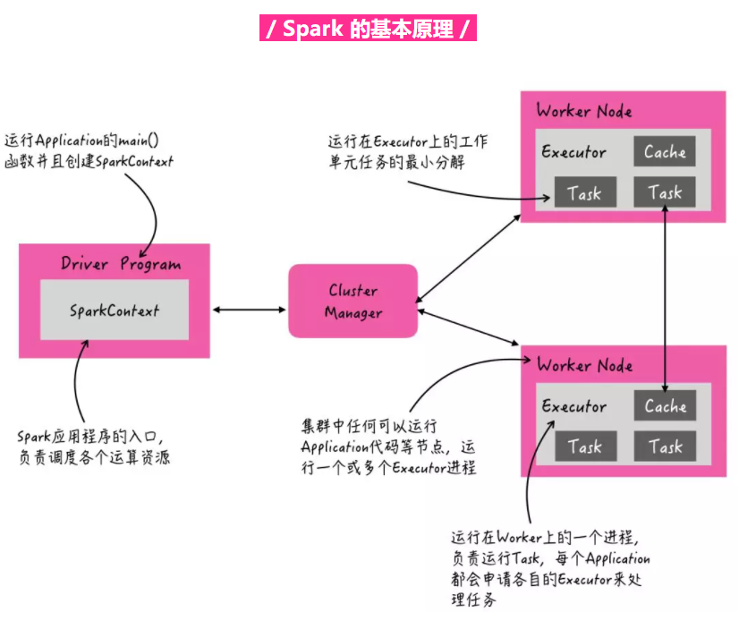

# 大数据相关

## 一、Spark

### 1、大数据三个需要解决的问题

大数据一般有三个问题需要解决：存储、计算、资源调度。

存储：一般是HDFS、Hive、HBase来做的

计算：MapReduce、Spark

资源调度：Yarn、Zookeeper、Mesos 

### 2、Spark的特点

Spark主要是一个基于内存计算的大数据框架，它把数据处理分为了两种核心操作：转换和行动。内置了很多转换算子和行动算子。

### 3、Spark的计算流程

### 4、Spark与MapReduce对比

### 5、Spark和MapReduce的容错性

MapReduce 中每一步操作的结果都会被存入磁盘，在计算出现错误时可以很好的从磁盘进行恢复；

Spark 则需要根据 RDD 中的信息进行数据的重新计算，会耗费一定的资源。Spark 提供两种方式进行故障恢复：通过数据的血缘关系再执行一遍前面的处理；使用Checkpoint 将数据集存储到持久存储中。

### 6、Spark的基本执行流程

1. 用户向Spark集群使用 `spark-submit` 命令提交应用程序并指定一些参数（Driver既可以运行在Master 节点上中，也可以运行在本地Client端），例如
   - --master 以什么模式运行：standalone方式或者yarn方式
   - 指定Diver端内存是多大
   - 指定有多少个Executor，每个Executor有多少个核心，占多大内存
2. 在Driver端运行应用程序并创建一个SparkContext来作为Spark应用程序的入口，负责调度各个运算资源Executor。（其中一个 Executor 是一个进程，运行各自的 task，每个 task 执行相同的代码段处理不同的数据。）
3. SparkContext向资源管理器（可以是Standalone、Mesos或YARN）注册并申请运行Executor资源
4. 资源管理器分配Executor资源并启动ExecutorBackend，Executor运行情况将随着心跳发送到资源管理器上
5. SparkContext 初始化包括初始化监控页面 SparkUI、执行环境 SparkEnv、安全管理器 SecurityManager、stage 划分及调度器 DAGScheduler、task 作业调度器 TaskScheduler 、与 Executor 通信的调度端 CoarseGrainedSchedulerBackend。
6. DAGScheduler根据RDD的血缘关系形成的DAG（有向无环图），从后先前根据各个RDD宽窄依赖关系划分出一个个Stage（当碰到Action操作时，就会催生Job；每个Job中含有1个或多个Stage，Stage一般在获取外部数据 和shuffle之前产生），然后把Stage（或者称为TaskSet）提交给Task Scheduler，Task Scheduler负责将Task分配到相应的Worker，最后提交给StandaloneExecutorBackend执行；
7. StandaloneExecutorBackend会建立Executor线程池，开始执行Task，并向SparkContext报告，直至Task完成。
8. 所有Task完成后，SparkContext向Master注销，释放资源。

（==划分任务后的具体细节：==DAG Scheduler 将作业划分后，依次提交 stage 对应的 taskSet 给 TaskSchedulerImpl，TaskSchedulerImpl 会 提交 taskset 给 driver 端的 CoarseGrainedSchedulerBackend 后端，接着 CoarseGrainedSchedulerBackend 会一个一个的 LaunchTask。在远端的 CoarseGrainedExecutorBackend 接收到 task 提交 event 后，会调用 Executor 执行 task，最终 task 是在 TaskRunner 的 run 方法内运行。）

### 7、DAGScheduler在进行stage划分时依据的窄依赖和宽依赖关系

==窄依赖：==子 RDD 中的每个分区都依赖 父 RDD 中的==一小部分分区==。

如：OneToOneDependency：一对一依赖。属于这种依赖关系的转换算子有 `map()`、`flatMap()`、`filter()` 等。

RangeDependency：范围依赖。属于这种依赖关系的转换算子有 `union()` 等。

NarrowDependency: 窄依赖类。上面的 `OneToOneDependency` 和 `RangeDependency` 都继承了 `NarrowDependency` 这个类。

==宽依赖：== 在`ShuffleDependency` 中，子 RDD 的一个分区依赖的是 父 RDD 中==所有分区==的某一部分。

`NarrowDependency` 不需要 shuffle 操作，并且可以用于流式操作（pipeline）。`ShuffleDependency` 则需要进行 shuffle 操作，有 shuffle 的地方需要划分不同的 stage。

### 8、Spark的shuffle操作

暂略

### 9、如何处理Spark计算过程中的数据倾斜问题？

- **问题描述**：大量的相同key在被分配到了同一个partition，导致1个executor耗时长，其他executor空闲，造成资源浪费；违背并行计算的初衷；
- **示例场景**：groupBy或reduceByKey等聚合算子生成的RDD可能会导致数据倾斜；
- **解决方案**：
  

1. 给每个partitionKey加上一个随机数后再聚合；
2. 聚合后的数据map去掉前缀；

### 10、广播变量的使用

将 Driver端读取的训练集以 广播变量的形式广播给各个 Executor，每个 Executor 保存一份训练集副本；如果 Driver 端读取的训练集以 List形式保存共享，Executor 的每个 Task 都会保存一份训练集副本。 假设在 1 个 Application 中分配 m 个 Executor，每个 Executor中有 n 个 Task 在执行，当训练集使用 广播变量的形式进行广播时，整个 Application 中 总共保存 m 份训练集副本；但当训练集使用 List形 式在 Driver端保存共享时，整个 Application 中总共 保存 m·n份训练集副本，所以采用 List形式保存共 享训练集会比广播变量形式多产生m·n-m=(n-1) · m 份训练集副本。当训练集较大、Task 的数量较多 时，重复保存的 (n-1)· m 份训练集副本会占用大 量的内存，甚至会导致内存溢出。

### 11、我实现的算法解决的问题

使用了 Spark 框架中的广 播变量、Cache 缓存机制和 CheckPoint操作。

之所 以使用==广播变量==，是因为如果不将数据集以广播 变量的方式由 Driver端发送给 Executor端，那么在 每次开启一个 Task 时，都会产生一个数据集的副 本。也就是说，使用广播变量的方式发送副本时， 副本个数等于集群中各台机器上 Executor 的数 量；而不使用广播变量的方式，直接在 Task 中使用 数据集时，那么每一个 Task 中都会保存一份数据 集的副本。当 Task 数大于 Executor 数时就会产生 冗余的数据集副本，不仅占用内存空间，而且会导 致算法运行效率不高的问题。

 使用 ==Cache 方法缓存种群 RDD==，可以在下一 次 对 种 群 RDD 的 行 动 算 子 执 行 完 之 后 将 种 群 RDD 缓存在内存中，种群 RDD 中的每个分区里的 子种群信息也都会保留下来，这对于需要在下一 个周期继续上次的迭代过程是至关重要的。如果 没有使用 Cache方法，那么在每一次迭代周期中种 群 RDD 都将被重新计算，将无法承接上一次的进 化结果继续进行种群进化，导致算法运行效率大 大降低。 

在算法流程中定期使用 ==CheckPoint 操作==的原因是由于在每一个迭代周期中都会由先前的 RDD 产生一个新的 RDD，并由此组成一条 RDD 关系 链，当这条 RDD 链变得很长时，其依赖关系也会变得很长 ，通 过 定 期 使 用 CheckPoint 来 将 种 群 RDD 保存在磁盘中，从而切断当前种群 RDD 与先 前种群 RDD 之间的血缘关系，可以避免在反序列 化当前种群 RDD 时由于过长的血缘关系而导致 性能低下的问题。

## 二、Hadoop

### 1、MapReduce的计算流程

### 2、MapReduce的不足

MapReduce 解决了大数据处理中多种场景问题，但是它的局限性也很明显：

- MapReduce 只提供 Map 和 Reduce 两个操作，欠缺表达力，复杂的计算需要大量的 Job 才能完成。
- 中间结果也放在 HDFS 文件系统中，迭代计算的话效率很低。
- 适用 Batch 数据处理，对于交互式数据处理而言实时数据处理的支持不够。
- 需要写很多底层代码，难上手。基本的 WordCount 程序至少需要三个 java 类：Map 类、Reduce 类、Job 类