# 面试项目

## 一、华胜工程项目协同平台

### 项目职责：

#### 1、系统权限架构设计

**设计项目、人员、角色多对多关系表，按层级划分公司职位，对其中的项目层级人员进行分配相应的项目角色权限。**

#### 2、BIM模型上传与预览

**使用分块上传和断点续传的方式上传大文件BIM模型；将BIM模型在云端转化为网页可在线预览的SVF清单文件后，采用多线程的方式下载所有文件到公司服务器，提升网页加载速度。**

**实现细节：**

BIM模型全称是建筑信息模型，它能够使工程建设专业人员获取某个建筑的3D模型信息。这个功能主要就是实现BIM模型的上传和预览。由于BIM模型通常都是几百M的大文件，所以就使用了文件分块和断点续传的方式来进行文件上传。

1）首先在浏览器端使用`vue-simple-uploader`对大文件进行分块，指定分块大小，失败后重传次数等参数，然后使用`spark-md5`计算 `totalChuck mod 10`选取其中10块来求md5值（使用整个文件来求md5值太慢了）。

2）将文件的文件名和文件标识发送给服务器，服务器根据当前文件标识去数据库中查询是否已上传，如果上传过了，那么返回文件已上传标识和文件相对路径；如果没有上传过，那么将在数据库中查询已经上传了哪些块，返回已上传的所有块号。

3）前端根据返回信息，去除已上传的块号，将剩余的文件块上传到服务器，每个文件块包含==（文件名，文件标识--md5值，块号，块大小，总块数，块文件）==信息，服务端收到每一个块后写入到指定文件夹（文件夹的名称就是上传文件的标识），块文件文件名为（文件名-块号.tmp）。

4）当前端上传完所有块后，会发送一个合并请求，服务端首先会检查是否所有的分块都已经在指定目录中，然后依次将其他块追加到第一个块中，等待追加完后重命名该文件，写入文件信息到数据库中（如果文件标识不存在的话）。

5）数据库中有一个`file_info`和`chuck_info`表，分别为

```sql
--文件表
CREATE TABLE `t_file_info` (
  `id` varchar(64) NOT NULL,  --文件id
  `filename` varchar(500) NOT NULL,  --文件名
  `identifier` varchar(64) NOT NULL,  --文件标识（md5）
  `type` varchar(10) DEFAULT NULL,  --文件类型
  `total_size` decimal(10,0) NOT NULL,  --文件总大小
  `location` varchar(200) NOT NULL,  --文件存储路径
  `del_flag` varchar(2) NOT NULL DEFAULT '0',  --是否删除
  `ref_project_id` varchar(64) NOT NULL,  --项目id
  `upload_by` varchar(64) DEFAULT NULL,  --上传人
  `upload_time` datetime NOT NULL DEFAULT CURRENT_TIMESTAMP,  --上传时间
  PRIMARY KEY (`id`)
) ENGINE=InnoDB DEFAULT CHARSET=utf8;

--文件分块表
CREATE TABLE `t_chunk_info` (
  `id` varchar(64) NOT NULL,  --分块id
  `chunk_number` decimal(10,0) NOT NULL,  --块号
  `chunk_size` decimal(10,0) NOT NULL,    --块大小
  `current_chunkSize` decimal(10,0) NOT NULL,  -- 当前块大小
  `identifier` varchar(64) NOT NULL,   --文件标识（md5）
  `filename` varchar(500) DEFAULT NULL,  --文件名
  `relative_path` varchar(500) NOT NULL,  --相对路径
  `total_chunks` decimal(10,0) NOT NULL,  --总块数
  `type` decimal(10,0) DEFAULT NULL  --文件类型
) ENGINE=InnoDB DEFAULT CHARSET=utf8;
```

==文件表`file_info`主要字段为：文件id，文件名，文件标识，文件存储路径==

==分块表`chunk_info`主要字段为：块id，块号，块大小，当前块大小，文件标识，文件名，存储路径，总块数==

#### 3、Word文件在线预览和编辑

**根据外部URL协议来编写脚本，打开用户本地的IE浏览器，内嵌本地Word到浏览器中，对文件进行在线编辑后上传到服务器；使用乐观锁机制来实现对文件的并发控制。**

**实现细节：**

华胜公司需要做一个Word文件在线编制的功能，我们首先是找了一个可以内嵌用户本地的Word到浏览器的在线预览插件，但这个插件只可以在IE中使用，考虑到用户可能会使用其他的浏览器打开，所以必须实现这样的一个功能：==如果用户当前使用的是IE内核的浏览器，那么就在当前浏览器中新开一个窗口；如果不是IE浏览器，那么就使用外部URL协议打开用户本地的IE浏览器。==当时想到使用外部URL协议，主要是由于在某次使用百度云时，在网页山保存了资源，想要下载时就会弹出一个提示要不要打开本地的百度云客户端，所以按这种方式去搜索，就找到了使用外部URL协议。

然后在IE浏览器中调用一个链接在线预览服务器上的Word文件，相当于是把用户本地的Word嵌入到了浏览器内，用户就可以在浏览器中对文件进行修改，然后点击上传按钮，保存到服务器中。但是这样会有一个并发修改的问题，可能会有两个人同时读取到服务器上的Word文件到本地浏览器，一个人修改后上传，另一个也修改后上传，后面上传的就会覆盖前一个人上传的。所以为了解决这个问题，我在文件表中添加了一个最后更新时间字段，每次在读取文件到本地浏览器时，会将文件的最后更新时间和文件都返回给浏览器端。在用户上传时，会将这个时间和修改后的文件上传到服务器，后端通过判断这个时间是否是数据库中的最后更新时间，如果是，那么更新数据库记录，覆盖对应文件。如果不是，那么说明这个文件已经被其他人修改了，所以需要先获取最新版，修改后再次上传。所以此时，就会提示用户保存刚刚修改的文件到本地，然后打开一个新的链接，这个链接就会返回修改后的文件和更新之后的时间。用户确认修改无误后，就再次提交。有点类似乐观锁中的CAS操作。

**外部URL协议：**

桌面应用程序其实也早就支持关联 URL 以便在浏览器中打开。当我们的程序关联了一个 URL 协议之后，开发的网站上就可以通过这个 URL 与程序进行互操作。

1、注册一个 URL 协议

要在 Windows 系统上注册一个 URL 协议，你只需要两个步骤：

- 好好想一个协议名称
- 在注册表中添加协议关联

2、例如`http://www.baidu.com`是一个协议，在注册表中添加一个自己的`prereadword://www.baidu.com`，这个prereadword就是自己定义的协议。

### 项目技术栈：

**Spring，Dubbo，SpringMVC，SpringBoot，Spring Security，Mybatis，MySQL，Thymeleaf，JQuery，Bootstrap**

### 项目成果：

**软件著作权三项。             项目地址：http://119.97.224.22:89/HSEPS （已上线）**

## 二、空气质量大数据分类算法优化项目

### 项目介绍：

**针对传统串行自适应差分进化极限学习机算法（SaDE-ELM）在湖北省空气质量监测数据集上运行效率不高的问题，使用Spark框架对算法进行并行化，在保证预测精度不丢失的情况下，显著地提升了算法的运行效率。**

### 项目职责：

1. **搭建 Hadoop、Spark集群，使用Eclipse连接集群将SQL Server数据库中空气质量监测大数据导入到 HDFS。**
2. **使用 Spark 对 HDFS 中的数据进行预处理操作，包括OneHot编码、数据归一化和PCA降维等。**
3. **实现并行的 SaDE-ELM 算法，将原有进化种群分割为多个子种群，每个子种群共同进化得到最优个体，使用最优个体来对数据集进行分类，算法运行效率提升了260%。**

### 项目成果：

**科研论文两篇 （EI检索一篇，RCCSE核心一篇）**

## 三、武汉建设监理咨询行业信用评价平台

### 项目介绍：

**将每两年一度的武汉监理与咨询协会对各个申报企业的信用评价流程线上化，主要流程为评分细则管理、企业申报、专家评分、评分结果展示与导出和企业评级。**

### 项目职责：

1. **评审版本管理功能。将评分细则、申报企业、评分结果等与年度信息关联，每开启新一年度的评审活动时使用反序列化的方式来对繁杂的企业申报信息进行深拷贝。**
2. **评分任务分配。管理员为专家组分配人员，为每个专家组分配待评审企业，最后由专家组组长对专家进行评分细则项的分配。**
3. **动态评分细则表导出功能。根据评分细则表的树结构导出带有合并信息的评分细则Excel表格。**

### 项目成果：

**软件著作权两项         项目地址：http://119.97.224.22:88（已上线）**


# 新版项目

## 一、华胜工程项目协同平台

整个系统基于Dubbo+Zookeeper的分布式架构，使用Nginx作为网关，使用Sentinal来进行熔断降级，使用Seta来管理分布式事务。

项目主要包括：用户服务，BIM模型上传和预览服务，预约服务，材料进场服务，检验批报验服务等。

我主要负责了用户服务，BIM模型上传和预览服务，预约服务的开发和维护工作。

项目架构图示例图如下

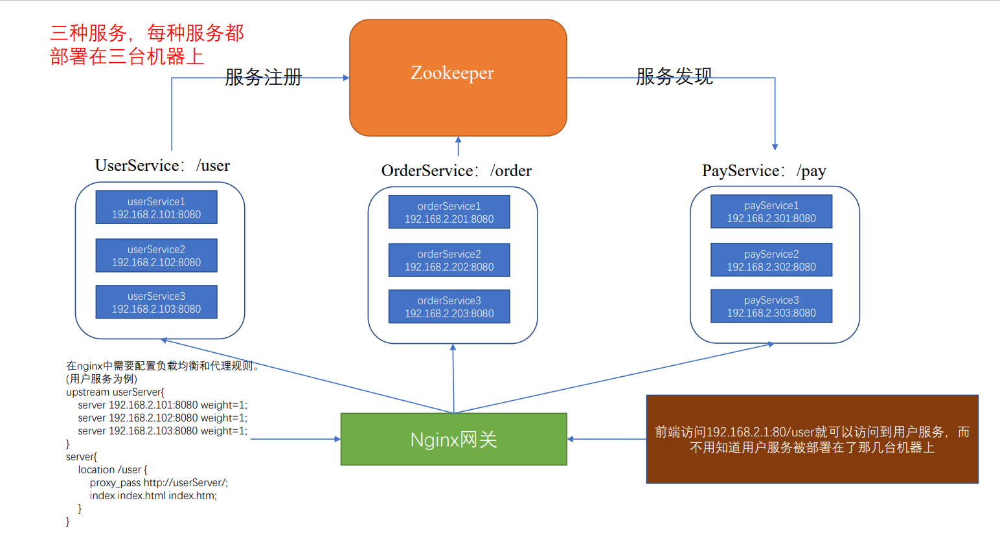

其中upstream配置的是负载均衡，可以指定策略，默认是轮询；location是配置的反向代理。

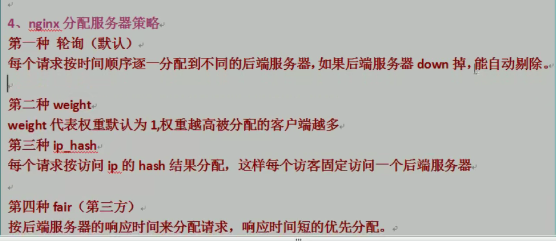

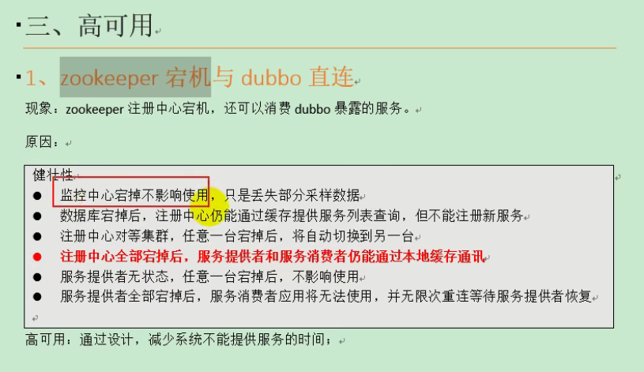

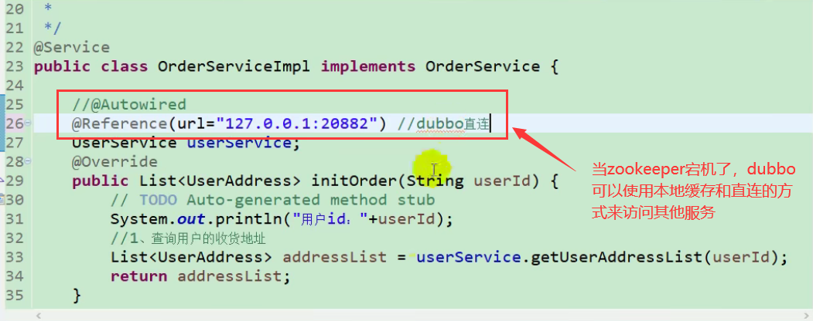

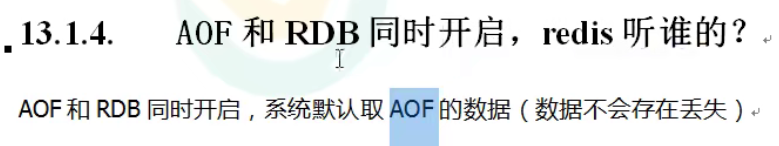

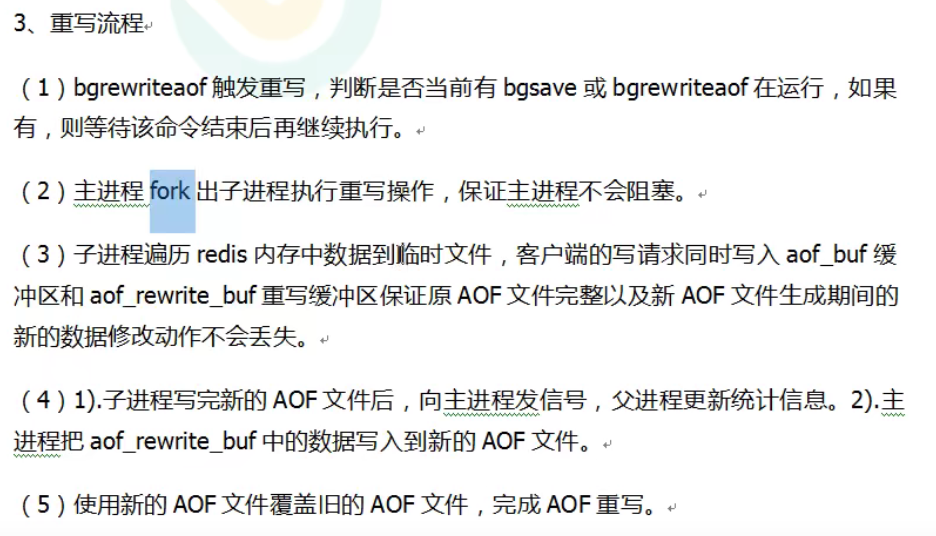

Redis主从模式：一主多从，主写从读。

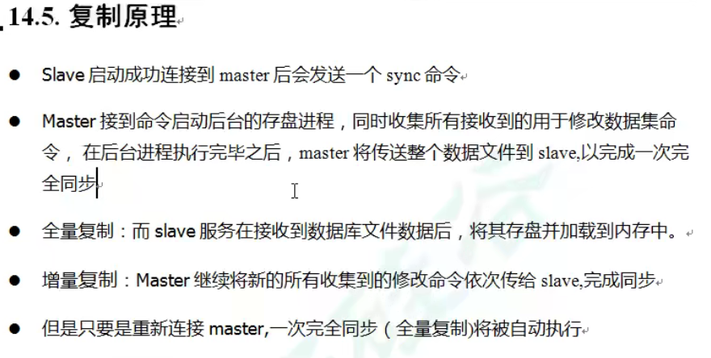

一台从服务器挂掉后，自己将变成主服务器，等到再用`slaveof ip port`命令加入主从结构后，会获取主服务器全部的数据。

主服务器挂掉后，从服务器不会做任何事，依旧认之前的主。等到主回来时，就恢复成主从结构。但是从服务器可以使用`slaveof no one`命令将自己变成主服务器。

哨兵模式：使用一个或多个哨兵来监控主服务器和多个从服务器，当主服务器挂掉时，几个哨兵投票选取一个从服务器让它来作为主服务器，而之前的主服务器设置为从服务器，等他再次上线时，就会变成从服务器了。

原理：从服务器变主服务器是哨兵向从服务器发送了`slaveof no one`命令，让它变成主服务器；等原来的主上线，哨兵会向它发送`slaveof 现在的主ip 现在的主port`

从服务器变主服务器的选举规则：

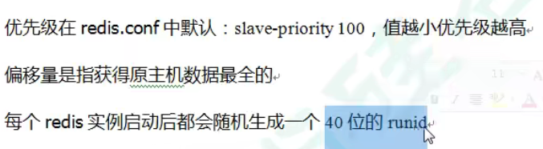


Redis集群模式：交叉部署，主服务器和从服务器尽量不在同一台机器上。

在Redis集群中可以使用多主多从，多个主节点一起来提供缓存服务。在集群中一共会有16384个slot（插槽），每个主节点上会存储一定范围的插槽（例如master1：0 - 5438，master2：5439 - 10456，等）。具体数据存在哪个插槽中，是使用公式 `CRC16(key) % 16384` （这里的16384是2的14次方，所以可以猜想Redis在计算具体slot时是使用 hash & ( 16384 - 1)来计算的）来计算的。

当集群中的某个主节点挂掉了，但其从节点没有挂掉时，集群会自动将从节点变为主节点，然后将原来的主节点变成其从节点。但如果某个slot范围内的主从节点都挂掉了，这时候就会根据一个集群的配置字段（是否需要完整的slot才可以提供服务），如果设置成是，那么整个集群就将不能继续提供服务；如果否的话，其他没有挂掉的主节点依旧可以提供服务。

分布式锁三种实现方式：数据库方式、Redis方式、Zookeeper方式

Redis之所以要使用原子操作释放锁，是由于A客户端比较完 lock 里的客户端id后，正在删除锁的时候，锁正好过期了。B客户端就可以拿到这个锁，并给它设置了自己的客户端id，但是这时候会被A客户端删除。也就是==客户端A释放了不是自己的锁==。

### 1、系统权限架构设计

基于Spring Security、JWT和Redis，构建分布式架构下的无状态用户认证服务，实现了分布式站点的单点登录（SSO）功能。

设计项目、人员、角色多对多关系表，按层级划分公司职位，对其中的项目层级人员进行分配相应的项目角色权限。

#### 1.1、有状态服务和无状态服务的区别？

==有状态服务==：例如Tomcat里的Session机制就是有状态的，在登陆成功后，将在服务端存储一个Session信息，其中可以包括用户信息，然后使用Set-cookie头部将SessionId返回给客户端。客户端在下次访问时就会带上这个cookie信息，服务端就可以通过Session中存储的用户信息，来判断当前是哪个用户在进行操作了。

缺点在于：

① 服务端保留大量的数据，增加服务端的压力。

② 在服务端保存用户登陆状态，不适合于多台机器的分布式服务部署

==无状态服务==：微服务集群中的每个服务，对外都是提供的Restful风格的接口，而Restful最重要的一个规范就是服务的无状态性。

① 服务端不保存任何客户端用户信息

② 客户端每次请求服务端的时候都需要带上自己的凭证信息，也就是token，服务端通过解析这个token来识别客户端的身份

好处在于：

① 服务端没有保存客户端的信息，客户端可以带上凭证，访问不同的服务器

② 服务端可以任意的迁移和伸缩

③ 减小服务端的存储压力

#### 1.2、如何实现无状态

无状态登录的流程：

- 首先客户端发送账户名/密码到服务端进行认证
- 认证通过后，服务端将用户信息加密并且编码成一个 token，返回给客户端
- 以后客户端每次发送请求，都需要携带认证的 token
- 服务端对客户端发送来的 token 进行解密，判断是否有效，并且获取用户登录信息

#### 1.3、JWT（Json Web Token）

JWT，全称是 Json Web Token， 是一种 JSON 风格的轻量级的授权和身份认证规范，可实现无状态、分布式的 Web 应用授权。

JWT 包含三部分数据：

- Header：头部，通常头部有两部分信息：
  - 声明类型，这里是JWT
  - 加密算法，自定义

我们会对头部进行 Base64Url 编码（可解码），得到第一部分数据。

- Payload：载荷，就是有效数据，在官方文档中(RFC7519)，这里给了7个示例信息：
  - iss (issuer)：表示==签发人==
  - exp (expiration time)：表示==token过期时间==
  - sub (subject)：==主题==
  - aud (audience)：受众
  - nbf (Not Before)：生效时间
  - iat (Issued At)：==签发时间==
  - jti (JWT ID)：编号

这部分也会采用 Base64Url 编码，得到第二部分数据。

- Signature：签名，是整个数据的认证信息。一般根据前两步的数据，再加上服务的的密钥secret（密钥保存在服务端，不能泄露给客户端），通过 Header 中配置的加密算法生成。用于验证整个数据完整和可靠性。

#### 1.4、Redis+JWT工作流程

前端服务器收到用户登录请求，传给后台API网关。API网关把请求分发到用户服务里进行身份验证。后台用户服务根据用户名密码验证通过，然后从账号信息抽取出userName、login_time等基本信息组成payload，进而组装一个JWT，把JWT放入redis(因为退出的时候无法使jwt立即作废，所以使用保存在redis中，退出的时候delete掉就可以了，鉴权的时候加一层判断jwt是否在redis里，如果不在则证明jwt已过期作废)，然后将jwt信息返回到前端服务器，这就登录成功了。前端服务器拿到JWT，在 localStorage 中进行存储，再访问其他微服务的时候，前端会携带jwt访问后台，后台校验 JWT，验签通过后，返回相应资源和数据就可以了。

==每一个token有一个过期时间还有一个刷新时间。过期时间为1个小时，刷新时间为7天。==

单独使用jwt的缺点在于：

① token一旦下发给客户端之后，在没有失效之前服务端都无法阻止用户访问资源。

② token中不能够存储大量的用户数据信息，而用户的很多基本数据信息又是经常会被用到的。在每次解析完token后，再去数据库查用户信息，导致响应速度较慢的问题。

jwt和Redis一起使用好处在于：

① ==在Redis中存储token并设置过期时间（过期时间为token的刷新时间）==，可以在判断权限的时候，==首先会判断Redis中是否存在该token信息，如果不存在则表示token已过期或者用户主动退出或者被踢下线了（服务端主动踢出用户时，只需要删除redis中的token）。==如果Redis中存在token，那么才会判断token是否过期，如果过期了，那么刷新token信息，重新写入Redis中并设置key的过期时间为token刷新时间，并且将新的token信息写入头部返回给前端。

② 可以在token中存储用户基本的少量信息，需要更多用户信息时，会首先去数据库中查，然后将查到的结果保存在redis中并设置过期时间，下次访问的时候就可以直接使用缓存的用户信息，避免了每次从数据库中查找所花费的时间。

#### 1.2、Spring Security实现登录流程：

登陆过程截图：

① 首先被UsernamePasswordAuthenticationFilter拦截，获取请求体中的用户名username和密码password，然后构造了一个UsernamePasswordAuthenticationToken用来存储用户名和密码信息，UsernamePasswordAuthenticationToken里面的详细信息如下图：

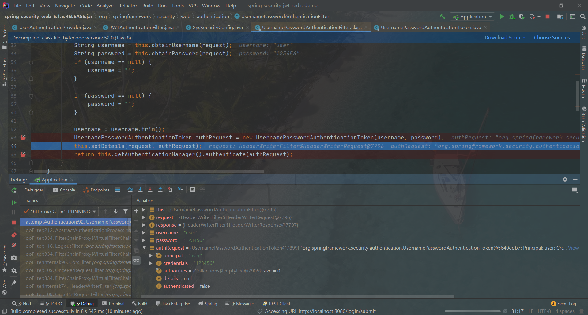

② 解析请求后继续填充UsernamePasswordAuthenticationToken里的details详细信息字段（包括ip地址和sessionId），如图

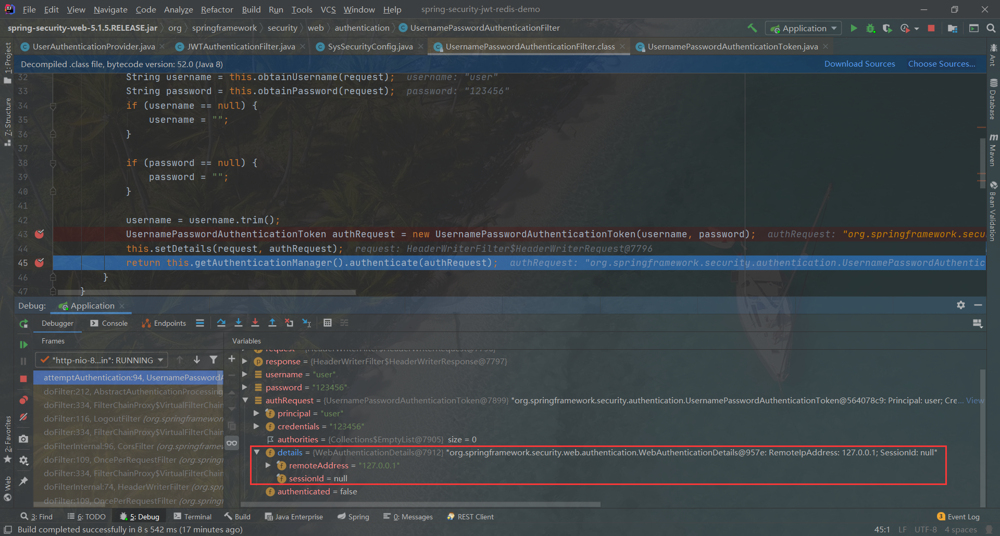

③ (根据token类型选择合适的AuthenticationProvider来处理认证请求)  [默认实现类：ProviderManager]

AuthenticationManager是一个用来处理请求的接口，它自己不直接处理认证请求，而是委托给其所配置的Authentication

Provider列表，然后会依次使用每一个 AuthenticationProvider 进行认证，如果有一个AuthenticationProvider 认证后的结果

不为 null，则表示该AuthenticationProvider已经认证成功，之后的AuthenticationProvider 将不再继续认证。然后直接以该 

AuthenticationProvider 的认证结果作为 ProviderManager 的认证结果。如果所有的 AuthenticationProvider 的认证结果都

为null，则表示认证失败，将抛出一个 ProviderNotFoundException。

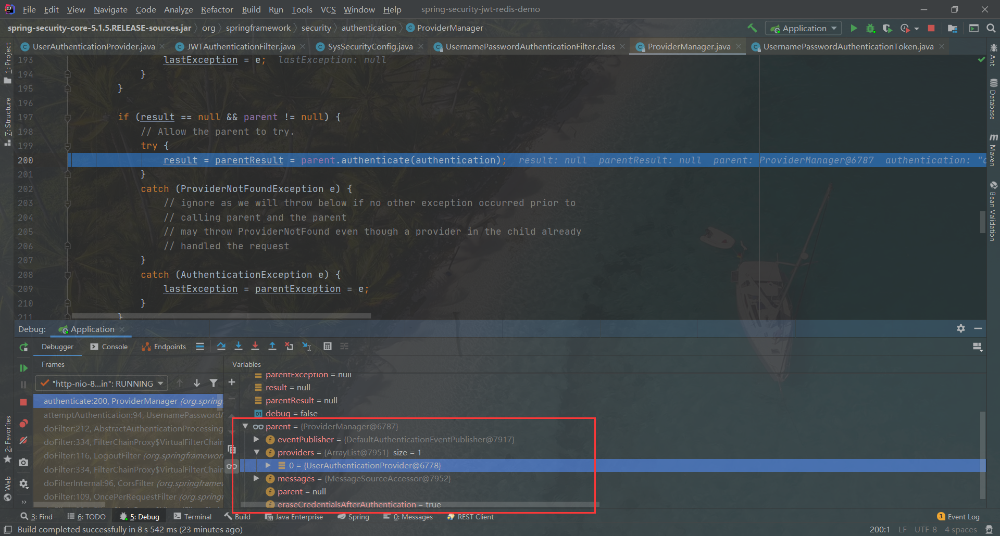

④ 使用我们自定义的UserAuthenticationProvider来进行验证

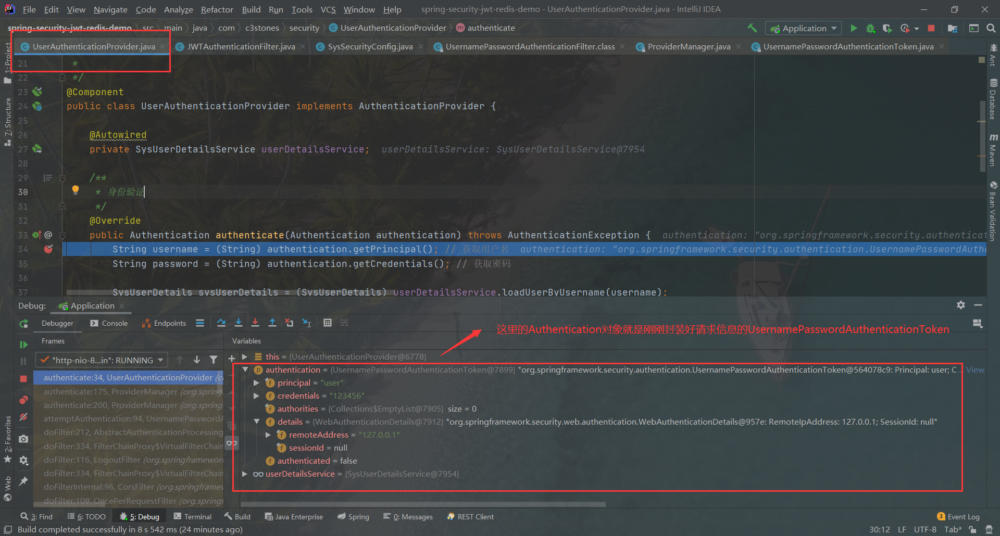

⑤ 调用我们自定义的UserDetailsService的实现类的方法去数据库或者其他地方查找用户数据，并返回封装为UserDetails的对象


⑥ 比较authentication里的用户名、密码和从数据库中查出来的UserDetails对象是否相同，如果相同，如果认证通过后会将该 UserDetails 赋给认证通过的 Authentication的principal，然后再把该 Authentication 存入到 SecurityContext 中。默认情况下，在认证成功后，ProviderManager也将清除返回的Authentication中的凭证信息。

==Authentication对象==

Spring Security使用一个Authentication 对象来描述当前用户的相关信息。SecurityContextHolder中持有的是当前用户的 

SecurityContext，而 SecurityContext 持有的是代表当前用户相关信息的 Authentication 的引用。这个 Authentication 对象

不需要我们自己去创建，在与系统交互的过程中，Spring Security会自动为我们创建相应的Authentication对象，然后赋值给当

前的SecurityContext。


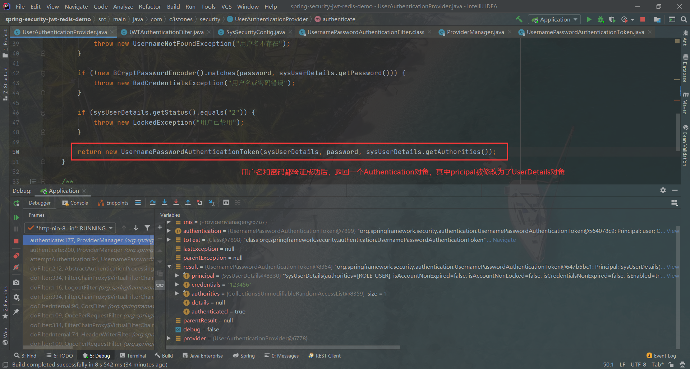

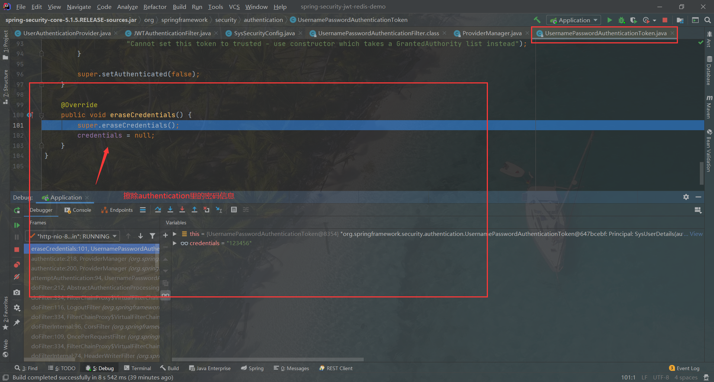

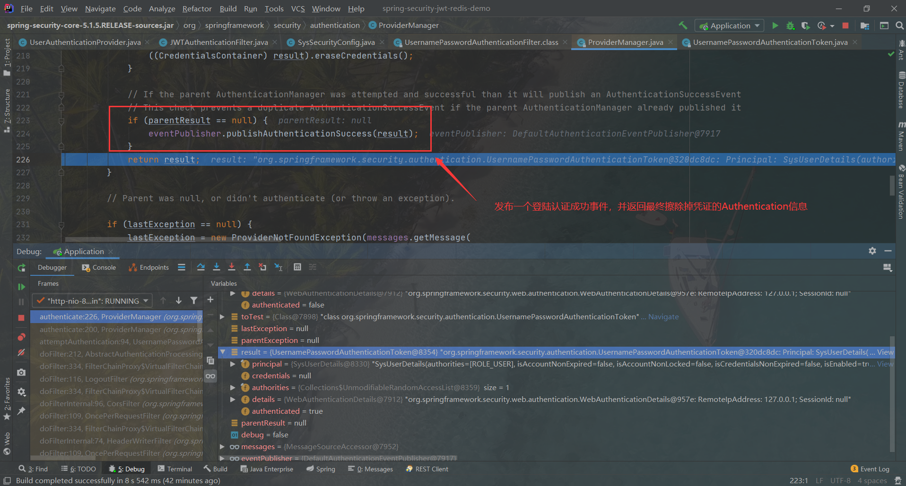

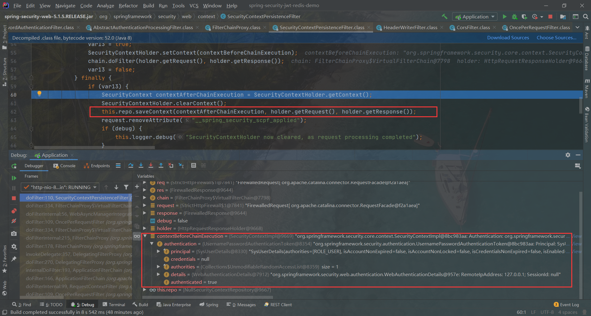

登陆成功：

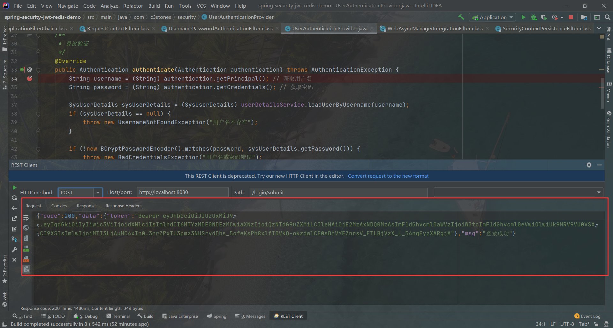

a) 实现一个 `UserDetails` 接口，重写 `getUserName()` 和 `getPassword()`  等方法，并扩充字段，添加自己所需用户类里的信息。

```java
public interface UserDetails extends Serializable {
    Collection<? extends GrantedAuthority> getAuthorities();
 
    String getPassword();
 
    String getUsername();
 
    boolean isAccountNonExpired();
 
    boolean isAccountNonLocked();
 
    boolean isCredentialsNonExpired();
 
    boolean isEnabled();
}

// 扩展自己的用户信息类后
public class User implements Serializable, UserDetails {
    private Long id;
    private String username;
    private String password;
    private String phone;
 
    private List<GrantedAuthority> authorities;
    
    @Override
    public String getUsername() {
        return username;
    }
    
    @Override
    public String getPassword(){
        return password;
    }
    
    //继承后必须返回为true
    @Override
    public boolean isAccountNonExpired() {
        return true;
    }
 
    @Override
    public boolean isAccountNonLocked() {
        return true;
    }
 
    @Override
    public boolean isCredentialsNonExpired() {
        return true;
    }
 
    @Override
    public boolean isEnabled() {
        return true;
    }
    
    public void setAuthorities(List<GrantedAuthority> authorities) {
        this.authorities = authorities;
    }
 
    //返回的值不能为null,否则返回的永远是null,就会一直没有权限，由此定义了一个authorities 属性并提供get方法，因为自
    // 定义了UserDetails，就没有在UserService中，使用到框架提供的User对象
    @Override
    public Collection<? extends GrantedAuthority> getAuthorities() {
       //不能返回null
        return authorities;
    }
    
    public void setAuthorities(List<GrantedAuthority> authorities) {
        this.authorities = authorities;
    }
    
    //默认使用恒等去判断是否是同一个对象，因为登录的同一个用户，如果再次登录就会封装
    //一个新的对象，这样会导致登录的用户永远不会相等，所以需要重写equals方法
    @Override
    public boolean equals(Object obj) {
        //会话并发生效，使用username判断是否是同一个用户
 
        if (obj instanceof User){
            //字符串的equals方法是已经重写过的
            return ((User) obj).getUsername().equals(this.username);
        }else {
            return false;
        }
    }

}
```

 b) 实现 `UserDetailsService` 接口，实现自己的从数据库从获取的用户详细信息。

